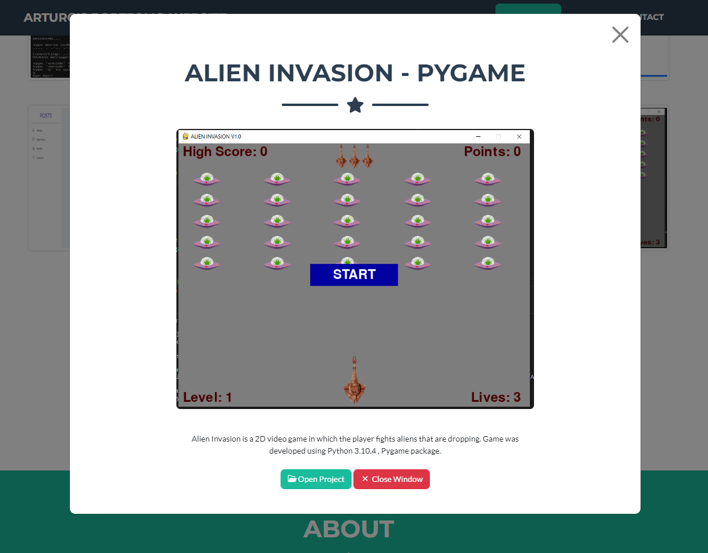

# 02_Portfolio_Website_Flask_ready_for_Heroku
Deployed on Heroku: https://arturos-portfolio-website.herokuapp.com/

This is a one-page Portfolio Website, a unique way to showcase my work and let others know about myself. It is ready to be published and launched on Heroku (https://www.heroku.com/). This way, it can be easily shared via a link with anyone who is interested in my work. The Portfolio Website was developed using the Python framework Flask, CSS, HTML, and Java Script with AJAX (fetch). The styling was done with the help of additional Bootstrap templates (https://startbootstrap.com/theme/freelancer), Bootstrap, and CSS. Additionally, the website is fully mobile responsive with an adaptive navigation bar, and it has a functional, dynamic contact form, which means that after submitting it, it won't reload the entire page. This functionality is achieved by sending a Java Script AJAX request ([fetch](https://developer.mozilla.org/en-US/docs/Web/API/Fetch_API)) to the Flask server in order to send the data from the form and later validate it on the server side. If successful, the server will send an email that will consist of the data from the contact form. The server will return json data to the website whether or not the process was successful, which will be rendered with JS as a short message below the contact form. In modern browsers, there is no need to use "AJAX" methods like XMLHttpRequest() or jQuery; the modern, built-in JavaScript solution to make these requests from a page is with the use of fetch. All projects listed on the website have a detailed view in a modal that will appear after selecting one of the projects.

---

Useful Links:

Deploying your web application with heroku  
https://www.heroku.com/  

Flask 
https://flask.palletsprojects.com/en/2.2.x/ 

Flask - AJAX - JavaScript, fetch, and JSON 
https://flask.palletsprojects.com/en/2.2.x/patterns/javascript/

Jinja templates 
https://jinja.palletsprojects.com/en/3.1.x/ 

WTForms 
https://wtforms.readthedocs.io/en/2.3.x/ 

Flask-WTF 
https://flask-wtf.readthedocs.io/en/1.0.x/ 

Bootstrap  
https://getbootstrap.com/  

Email SMTP  
https://docs.python.org/3/library/smtplib.html  

---

The necessary steps to make the program work: 
1. Install the required libraries from the requirements.txt using the following command:  
*pip install -r requirements.txt* 
2. Before using the program, we need to create a Gmail account that the program can use and generate an app_pssword for our account (https://help.prowly.com/how-to-create-use-gmail-app-passwords). After creating the Gmail account, we have to change the name of .env.example to .env and define the environmental variables according to our account: 
**MY_SENDER_EMAIL** = "EXAMPLE.USER@gmail.com" - this is the email address that will be used to send the contact form email. 
**MY_SENDER_EMAIL_GMAIL_APP_PASSWORD** = "GMAIL_APP_PASSWORD" 
**RECIVER_EMAIL_FOR_CONTACT_FORM** = "YOUR_HOST_EMAIL_FOR_CONTACT_FORM@gmail.com" - where the contact form emails will be sent. 
3. Define the Flask environmental variables in .env (https://flask.palletsprojects.com/en/2.2.x/config/#SECRET_KEY): 
**FLASK_SECRET_KEY** = "your_secret_key_keep_it_secret" 
4. Define the rest of the environmental variables: 
**LINKEDIN** = "https://linkedin.com/in/your_account" - your linkedin profile 
**GITHUB** = "https://github.com/your_account" - your github account 
5. Execute main.py to ensure that the website is operational on your local host. 
--- The next step is to deploy and launch on Heroku --- 
6. Download and install git https://git-scm.com/. 
7. Sign up for a free Github account at https://github.com/. 
8. Using git version control, commit your project locally and create a new repository on GitHub. 
You will have to push your local commit to it. 
9. Sign up for a free Heroku account at https://www.heroku.com/. 
10. Create a new Heroku app, select GitHub as the deployment method, and connect to your account. 
Next you will have to select (search by name) your repository that you created and pushed to your local commit (see step 8). Dont forget to enable Automatic Deploys - this means that whenever you push a new commit to your remote GitHub repository, it will automatically re-deploy your server with the changes. Next, you will have to deploy the Brnach. 
11. The final step is to define your environmental variables (in Heroku). 
Add the rest of the variables (under settings in the section of Config Vars) by defining: 
**your secret flask key** 
FLASK_SECRET_KEY = 'your_secret_key_keep_it_secret' 
**a Gmail account through which emails will be sent** 
MY_SENDER_EMAIL = "EXAMPLE.USER@gmail.com" 
**your gmail app password** 
MY_SENDER_EMAIL_GMAIL_APP_PASSWORD = "GMAIL_APP_PASSWORD" 
**where all the emails from the contact form will be sent to** 
RECIVER_EMAIL_FOR_CONTACT_FORM = "YOUR_HOST_EMAIL_FOR_CONTACT_FORM@gmail.com" 
**your social media links** 
LINKEDIN = "https://linkedin.com/in/your_account" 
GITHUB = "https://github.com/your_account" 
12. Now your website should be running. 

---

**Example view:** 
 

 

---

**Example view - detailed view - modal:** 
 

---

**The program was developed using python 3.11.0, Flask 2.2, Flask-WTF, Email SMTP, JavaScript (AJAX - fetch), HTML, CSS, Bootstrap 5.1**

In order to run the program, you have to execute main.py.
And your website will be accessible under localhost:5000 (http://127:0:0:1:5000).