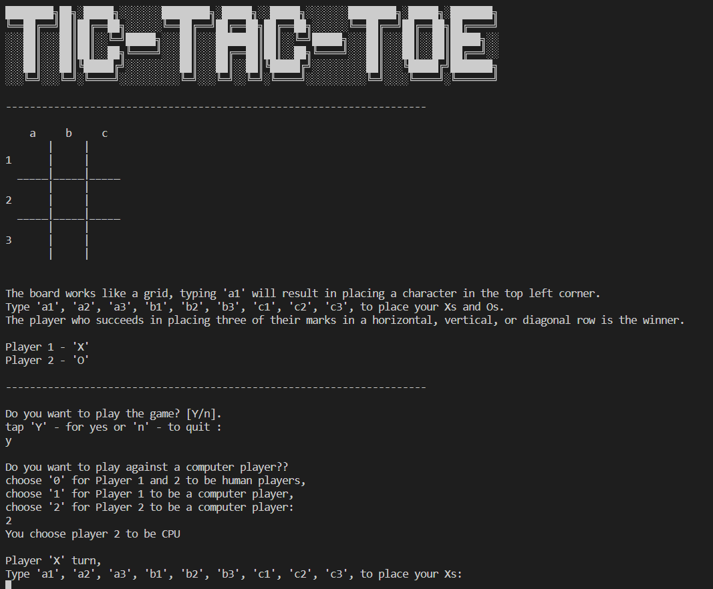
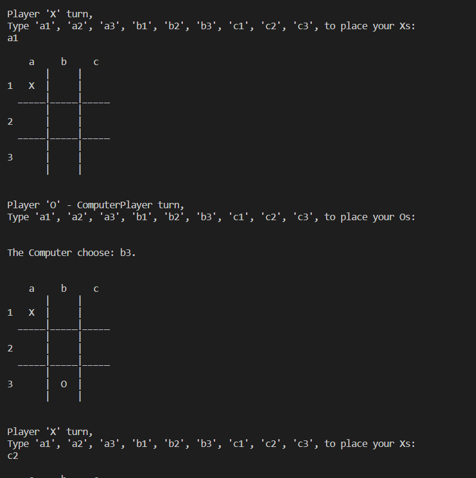
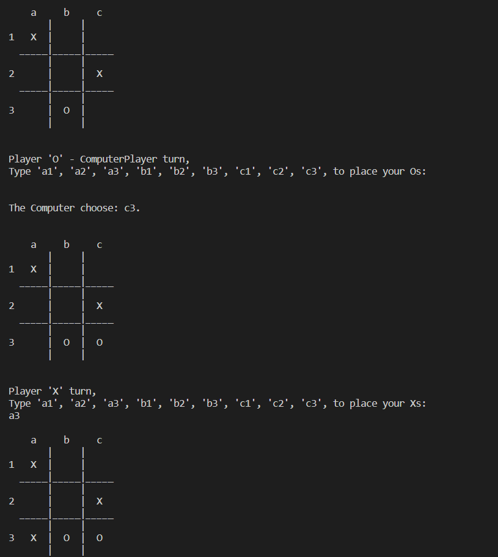
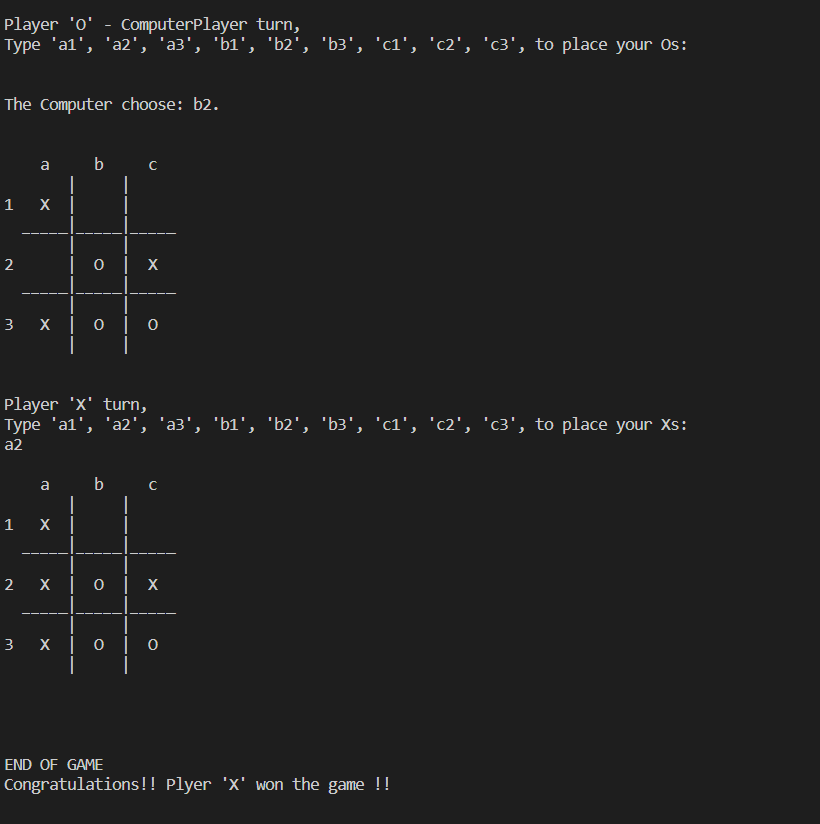

# 03_Tic_Tac_Toe

This is a text-based version of the popular [Tic-Tac-Toe](https://en.wikipedia.org/wiki/Tic-Tac-Toe) game. It is playable from the command line, and it has to be played by two players.
The user gets to choose whether to play against another human player or a computer player (and the user can choose if player 1 or player 2 should be the computer player). The algorithm for the computer player is implemented by checking which fields are empty and choosing a random one. This way, the computer player always leaves some room for the human player to outsmart him.
In the game, two players take turns and place an "X" or "O" in a three-by-three grid. The player who succeeds first in placing three of the same marks in a horizontal, vertical, or diagonal row is the winner. There are in total nine moves the players can make, and if, by placing the last mark on the grid, no one wins, it will be a draw (out of moves). The first game is always started by Player 1 (X), but they always take turns, so when the second game begins, it could be either Player 1 (X) or Player 2 (O), depending on who ended the previous game. The program was developed using the Object Oriented methodology. 
Can you beat the computer player?? 
Have fun playing!  
 
---

The necessary steps to make the program work: 
1. Install the Python version as stated in runtime.txt (python-3.11.0) 

---

**Example view:** 
 

 

 

 

  

---

**The program was developed using python 3.11.0**

In order to run the program, run main.py.  
 
