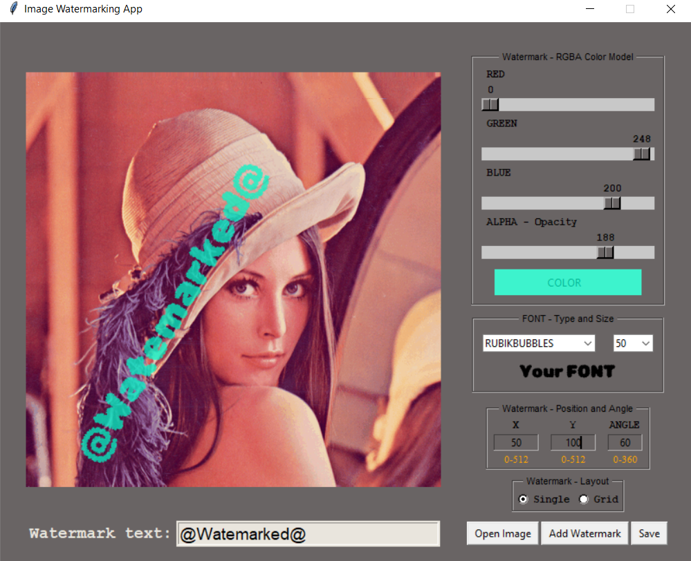
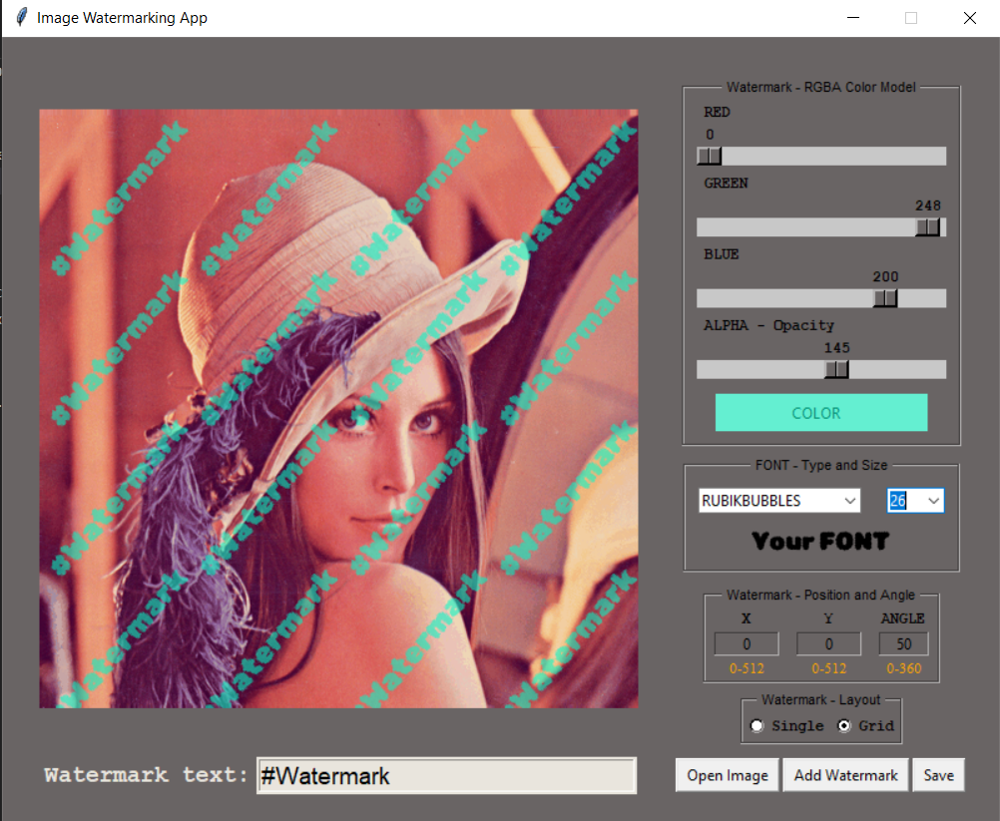
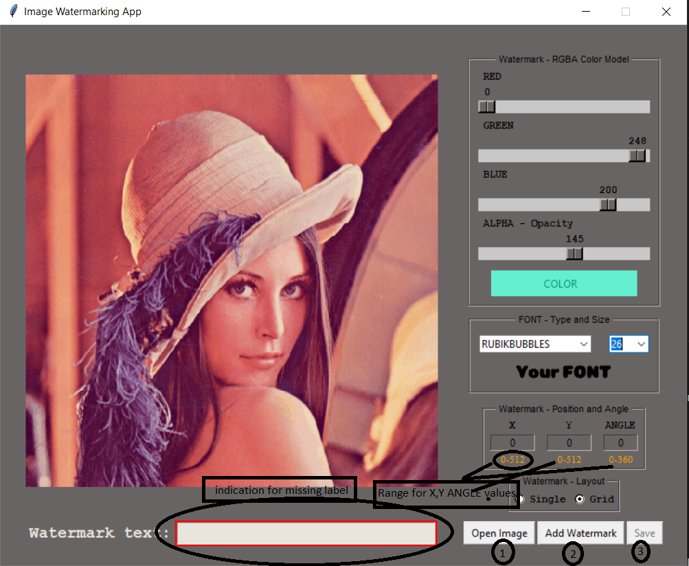
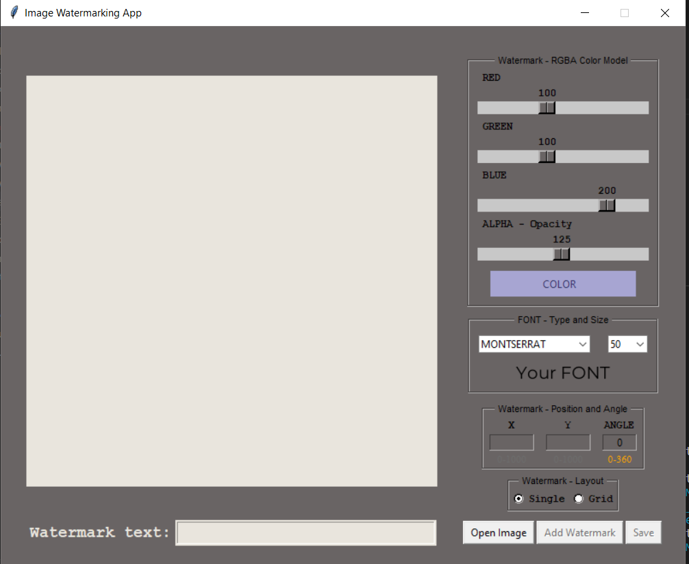

# 04_Image_Watermarking_Desktop_App
 
This is a desktop application that makes it possible to add watermarks to uploaded pictures.
Watermark is a pattern that appears as various shades of lightness or darkness to help identify the picture.
This app was developed using Python and Tkinter for creating a graphical user interface.
It will make it possible to add a logo to any image you want. It's basically like an image editing software like Photoshop for adding the watermark, or like an online service like https://watermarkly.com/.  

How to use the program: 
1. First, the user has to upload a new image with the button "Open Image." This will open a new window in which the user must select the image to be uploaded, after which the watermark can be added. If a picture is not uploaded, the buttons for adding a watermark and saving the picture with a watermark will remain disabled. 
2. After a successful upload, the image will appear in the program's main frame. The next step is setting all the
properties for the watermark. Actually, the only necessary property is the "Watermakr text", which can't be left empty. When we hit the button to add a watermark, it will highlight red to indicate that it needs a value.
The rest of the properties can be set to default (left). After pressing the "add watermark" button, a watermark will appear on the main frame of your picture to depict how it will look. This will enable the last step. 
3. (Optional)  
Every time we hit the button "Add watermark," the old one will be erased and a new one will be depicted on the
main frame on the picture.  
- The first property the user can play with is the color of the watermark. It is set in the RGBA mode (https://en.wikipedia.org/wiki/RGBA_color_model), so by setting three variables (red, green, and blue), we can define any color we want, and we can add transparency to it by changing the ALPHA parameter. 
- The next property that can be adjusted is the font type and size. We have five font types to choose from, and we can select a size from the drop-down box (8–92).  
- Another property are the watermark's position (X,Y and angle). The angle defines how the watermark will be rotated; accepted values are as indicated below the input box, 0-360 (including). X and Y values depend on the size of the picture, and the accepted values will also be indicated under the inputs. If the user chooses the "single" layout for one watermakr on the picture, then the X and Y positions will be the starting positions of the logo on the picture (this is why the limitation for X and Y is based on the maximum size of the picture). If the user chooses "Grid" layout, there will be equally spaced watermarks over the picture, and the x and y positions will merely be an additional offset.  
There is validation implemented for the X, Y, and ANGLE inputs; this means that the user can only write values (and ranges) that are allowed!
4. After adding the watermark, we have to save the picture. It will be saved under the folder /img in the same directory as the file main.py. The program will also automatically add to the filename a watermarked text to indicate that the picture was saved with the watermark. The program will also determine if there is already a file with the same name; if so, it will add in brackets a number starting with 1 and going all the way up until it finds a name that does not exist. After the picture with the watermark is saved, it will
disable the "Add Watermark" and "Save" buttons and also change the view of the main frame to default, which is blank space. And the process of adding another image and watermark can start over. 

 
---

useful links: 

Pillow
https://pypi.org/project/Pillow/

Tkinter
https://docs.python.org/3/library/tkinter.html

---

The necessary steps to make the program work: 
1. Install the Python version as stated in runtime.txt (python-3.11.0) 
2. Install the required libraries from the requirements.txt using the following command:  
*pip install -r requirements.txt* 
---

**Example view from the Desktop app:** 
 

 
 
 
 

 

**Example output**

 

 
.png) 

---

**The program was developed using python 3.11.0 and Tkinter**

In order to run the program, run main.py.
