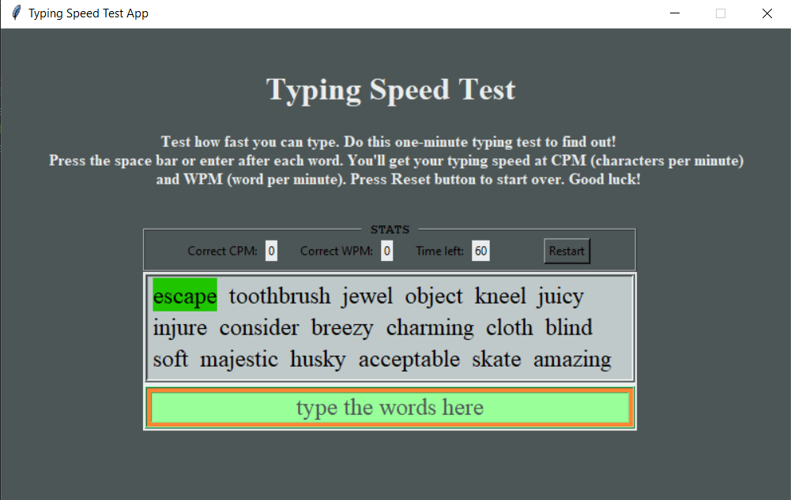
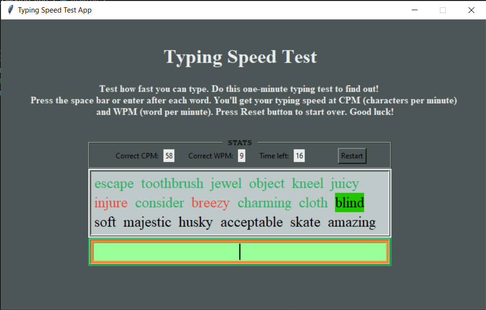
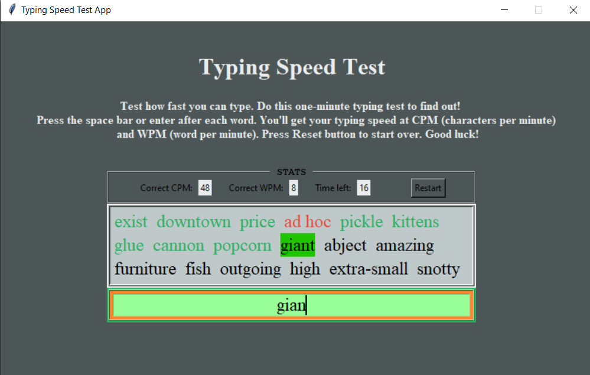
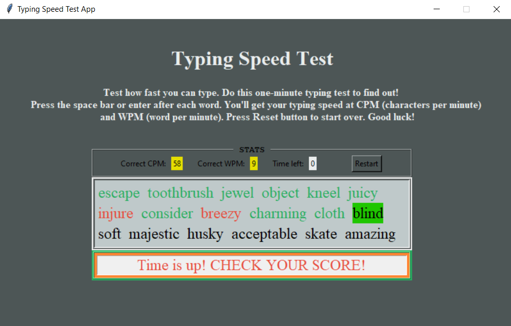

# 05_Typing_Speed_Test_Desktop_App

This desktop application was developed using Python 3.11 and Tkinter for creating a graphical user interface.
The main purpose of this application is to assess the typing speed of the user.
The average typing speed is 40 words per minute. But with practice, you can speed up to 100 words per minute.
It is similar to the online typing-speed-test app: https://typing-speed-test.aoeu.eu/.
How does it work? The user is given some sample text as words, and the user has to start typing them down one by one.
The timer starts counting down from 60 seconds when the user starts typing the first word.
When the timer hits 0, it stops, the user input will be disabled, and the user can check how many words per second (WPS) and how many characters per second (CPS) was it possible for the user to type in a minute.
Each time the user hits the space bar or the enter key, the app will compare the input word with the sample word that was supposed to be typed.
If the user typed the word correctly, it will be highlighted in green, and if the user typed the word incorrectly, it will be highlighted in red.
The current word to be typed will have a green tag around it.
The user can restart the program by pressing the Restart button at any time. 

---

useful links: 

Tkinter
https://docs.python.org/3/library/tkinter.html

---

The necessary steps to make the program work: 
1. Install the Python version as stated in runtime.txt (python-3.11.0) 
2. Install the required libraries from the requirements.txt using the following command:  
*pip install -r requirements.txt* 
---

**Example view from the Desktop app:** 
 

 
 
 
 

 
 
---

**The program was developed using python 3.11.0 and Tkinter**

In order to run the program, run main.py.
