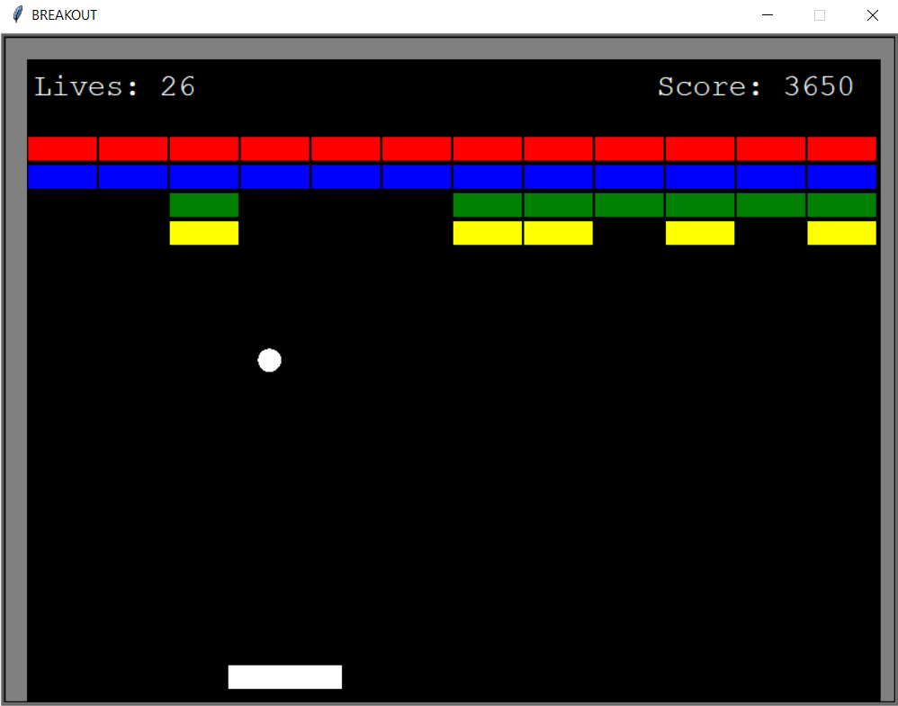
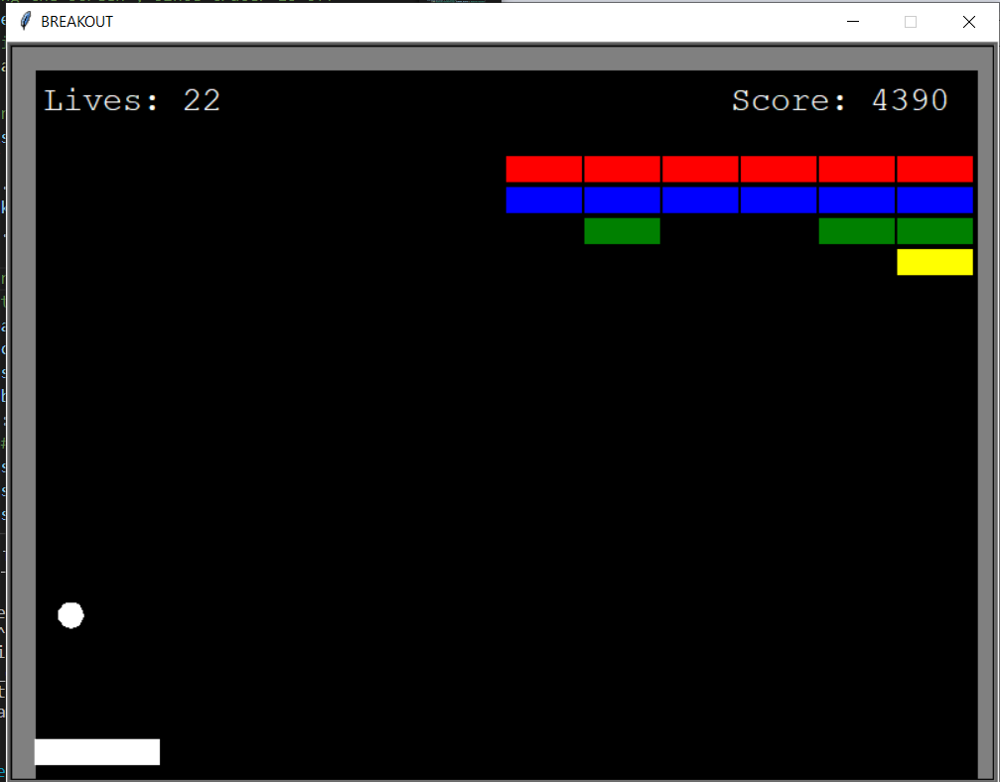
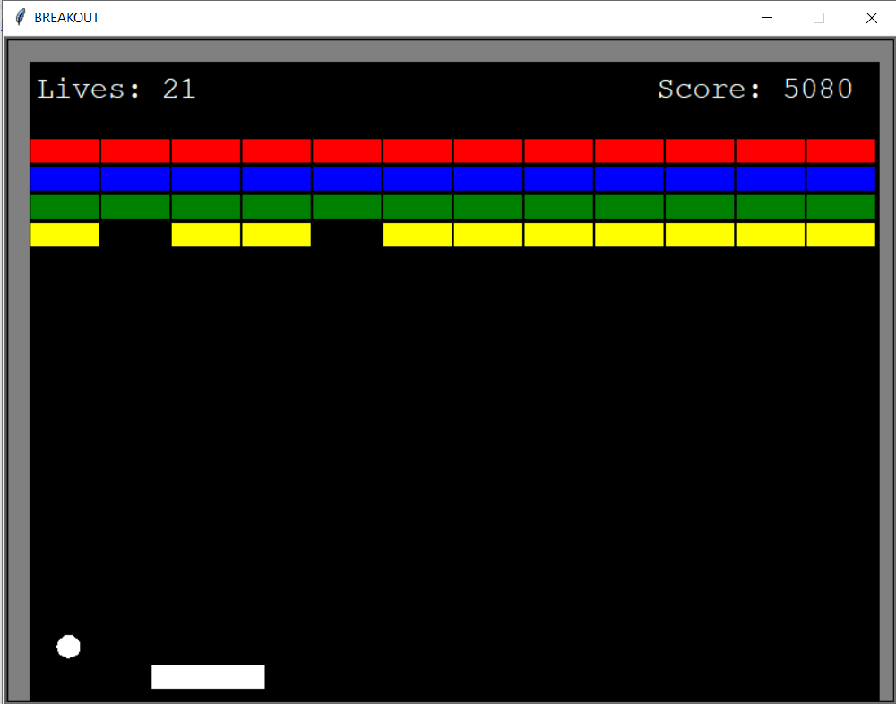
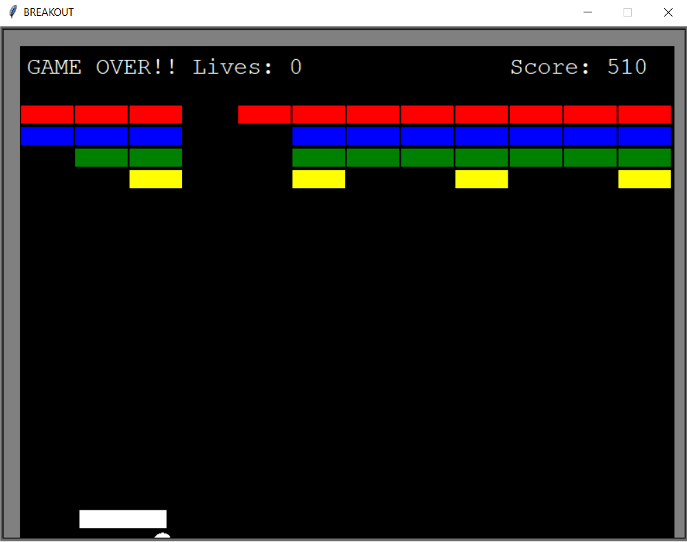
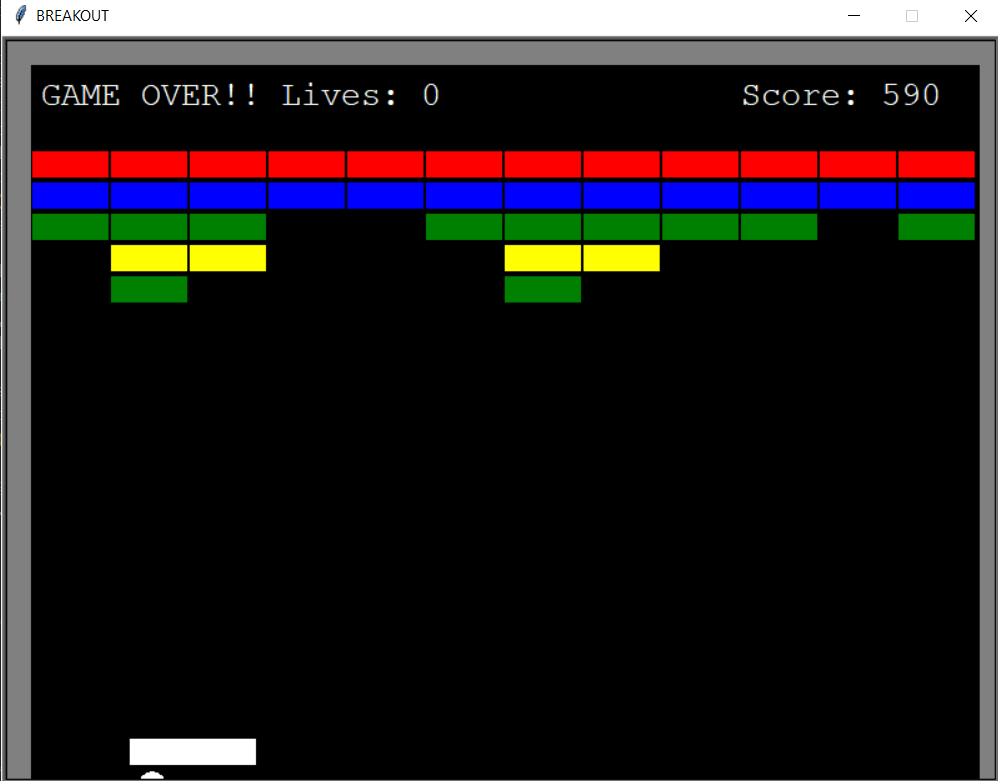

# 06_Breakout_arcade_game

This is a recreation of the famous game Breakout, which was a hit game originally coded up by Steve Wozniak before he and Jobs started Apple.
You can read more about the original game here: https://en.wikipedia.org/wiki/Breakout_(video_game)
It was developed using Python 3.11 and Turtle graphics. The main aim of the game is to use the ball and paddle to break down the wall.
The user will start with three lives, and every time the ball misses the paddle, the user will lose one. If the player runs out of lives, the game is over. The aim is to make sure the ball bounces off the paddle and breaks as many blocks as possible. If all the blocks are broken,
The whole layout will be reloaded, but your score will keep going. Try to achieve the highest score! 

---

useful links: 

Turtle
https://docs.python.org/3/library/turtle.html

---

The necessary steps to make the program work: 
1. Install the Python version as stated in runtime.txt (python-3.11.0) 
2. Install the required libraries from the requirements.txt using the following command:  
*pip install -r requirements.txt* 
---

**Example view from the Desktop app:** 
 

 
 
 
 
 

 

---

**The program was developed using python 3.11.0 and Turtle graphics**

In order to run the program, run main.py.