# 07_Cafe_and_Wifi_Website

This is a fully-fledged website that is mobile-responsive. It lists cafes where users can explore some interesting facts about them; it will show how work- or study-friendly they are based on such factors as WiFi access, toilet access, electrical sockets, the option of taking calls, seating, and coffee price. This website stores the data in a SQLite database in two tables. One table will include all of the cafes, while the other will include all of the users. There is a one-to-many relationship between a user (the creator of the cafe on the website) and a cafe. There are two different users: one is authenticated (logged in), and the other is anonymous (not logged in). Only authenticated users will be able to delete and add cafes to the website's database. The Cafe Wifi website was developed using the Python framework Flask, JavaScript, and HTML, and the styling was done with CSS and Bootstrap 5.2. 

The main features are: 
- RESTful website: Authenticated users will be able to add new cafes and delete existing cafes from the database (via Flask HTTP requests and forms WTF and AJAX JavaScript) on the Cafe Wifi website. Only authenticated users will have those rights. Unauthenticated users will only be able to browse the website.  
- User authentication for the website and assigning different permissions based on their status. There will be 2 groups that are distinguished: logged-in users and anonymous users (not logged in).  
- passwords that have been hashed and salted are saved in the database. 
- all cafe and user data will be stored in a SQLite database and managed using Flask-SQLAlchemy. 
- use of Gravatar images to provide an avatar image for website users. 
- making use of relational databases (one-to-many relationships).  
- message flashing using Flask Flash to give feedback to the user. They will be visible only for one session.  
- a multi-page website with an interactive side bar.  
- fully mobile responsive with an adaptive side bar. 
- customised error handling-403-page Forbidden. 
- customised error handling-404-page not found. 
- customised error handling-405 Method Not Allowed.  

The data is stored in two different tables using an SQLite database (if launched locally) managed with the help of Flask-SQLAlchemy. Between these two tables, there exists a database relationship "A one to many," which makes it easy to locate all the cafes that were created by a certain user. The Cafe Wifi website can perform POST, GET, and DELETE HTTP requests in order to create, retrieve, or delete cafes or users from the database.

 
The main page consists of a list of cafes with the option to open a Google link to them or to delete the cafe (only visible and accessible if the user is logged in). Users who are not logged in and try to add a cafe will get redirected to the login website, where they can either log in with their credentials or create a new account. After creating an account, the user will be automatically logged in. A notification will always appear at the top of the screen, enhancing the user experience (flash message visible for one session only). Flask flash messaging was implemented to give feedback to the user if the email address is incorrect, like if it already exists in the database, or if the email address does not exist and the user tries to login, or if the password was wrong, or when a cafe will be added, or if the cafe name already exists in the database.

Each user who wants to be authenticated needs to register. After registering, the users' data will be stored securely in the database. Afterwards, the user can simply log in to the Cafe Wifi website.
When the user gets registered, the email address, user name, and hashed password with salt are stored in the database in the users table. This website shows how authentication is done with the use of Flask and Flask-login while maintaining the highest level of security by hashing the user passwords, adding salt to them, and then storing the hash in the database instead of the password itself. Every user who is logged in can always log out.

If the user is not logged in or does not have permission to access a specific website or send DELETE requests, the server will respond with a customized error message:  
- HTTP 403: Forbidden  
- HTTP 404: page not found  
- HTTP 405: Method Not Allowed  

---

Database Schema: 

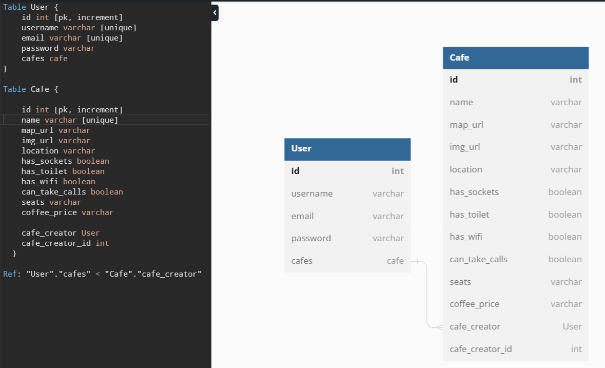 

---

Useful Links:

Flask 
https://flask.palletsprojects.com/en/2.2.x/ 

Flask - Message Flashing 
https://flask.palletsprojects.com/en/2.2.x/patterns/flashing/ 

Flask-Gravatar 
https://pythonhosted.org/Flask-Gravatar/ 

Flask-Login / Authentication 
https://flask-login.readthedocs.io/en/latest/ 

WTForms 
https://wtforms.readthedocs.io/en/2.3.x/ 

Flask-WTF 
https://flask-wtf.readthedocs.io/en/1.0.x/ 

Viewing database - SQLite browser  
https://sqlitebrowser.org/dl/  

Flask-SQLAlchemy 
https://flask-sqlalchemy.palletsprojects.com/en/3.0.x/ 

SQLAlchemy 
https://docs.sqlalchemy.org/en/14/orm/query.html  

Environmental variables 
https://pypi.org/project/python-dotenv/ 

Bootstrap - icons with CDN 
https://icons.getbootstrap.com/ 

Bootstrap 
https://getbootstrap.com/docs/5.2/getting-started/introduction/ 

Jinja templates 
https://jinja.palletsprojects.com/en/3.1.x/ 

Hashing + Salting a password 
https://werkzeug.palletsprojects.com/en/2.2.x/utils/ 
https://werkzeug.palletsprojects.com/en/2.2.x/utils/#werkzeug.security.generate_password_hash 

---

The necessary steps to make the program work: 
1. Install the Python version as stated in runtime.txt (python-3.11.0) 
2. Install the required libraries from the requirements.txt using the following command:  
*pip install -r requirements.txt* 
3. Change the name of .env.example to .env. 
4. Define the Flask environmental variables in .env (https://flask.palletsprojects.com/en/2.2.x/config/#SECRET_KEY): 
**FLASK_SECRET_KEY** = "your_secret_key_keep_it_secret" 
5. You have the option of using the existing database (at this point, you will use SQLite) with defined users and cafes or creating a new one. 
Alternatively, you can simply delete the database instance/data.db and then run run_main.py.
A new, empty database will be created, and you will have to register the users and add cafes. 
I recommend using the SQLite browser to explore the data currently saved in the database (there are two tables, users and cafes). 
6. Execute run_main.py to ensure that the website is operational on your local host. 
7. Now your website should be running. You can register users or add cafes and explore the functionality. 

---

**Example views from the website:** 
 

***Home page view - logged in user. *** 
 

---

***Adding a Cafe view.*** 
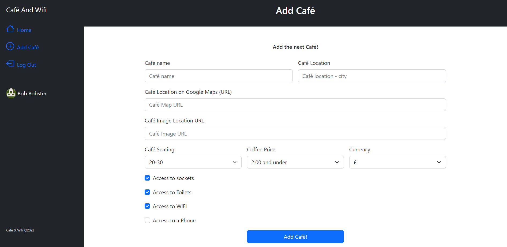 

---

***Validation error while adding a cafe: "name exists already in the database."*** 
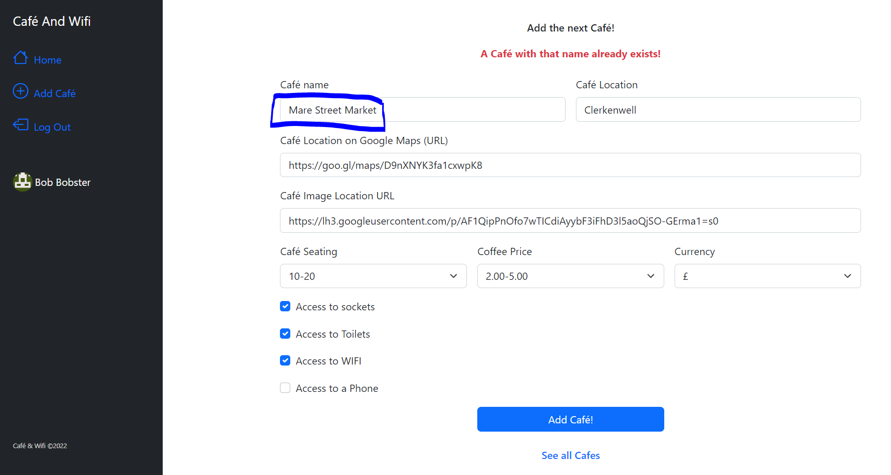 

---

***View while logged out - redirecting to home view.*** 
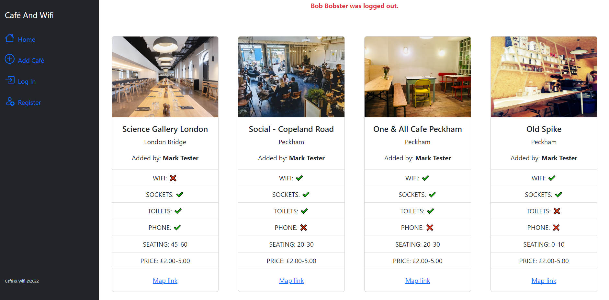 

---

***If you are not logged in and try to add a cafe, you will be redirected to Log In view.***  
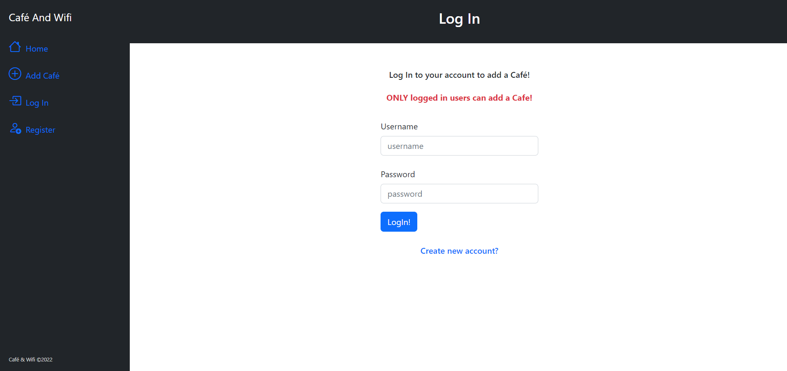 

---

***Creating an account and registering a user view.*** 
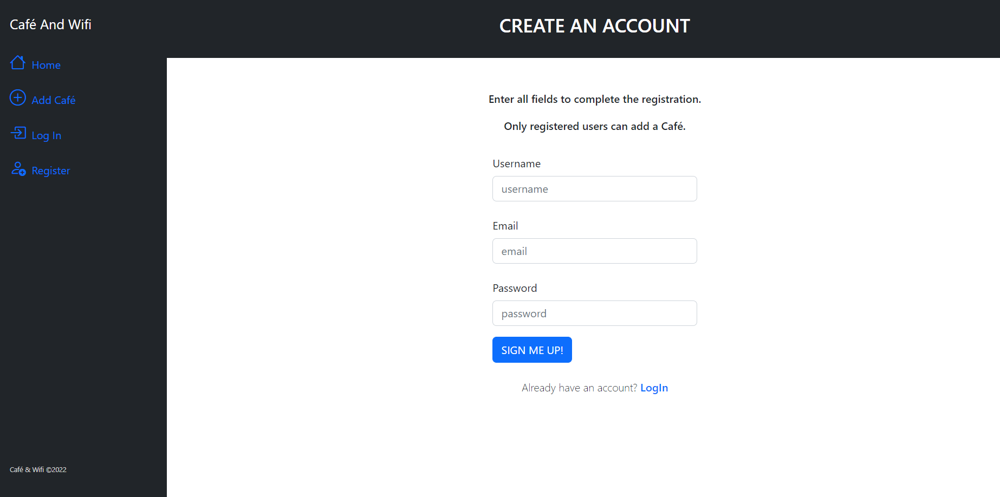 

---

***Custom error page 404 view.*** 
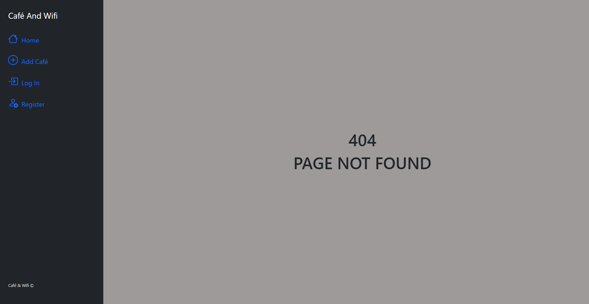 

---

***View after registering for an account (redirects to the home page) The flash message at the top is active only for one session.*** 
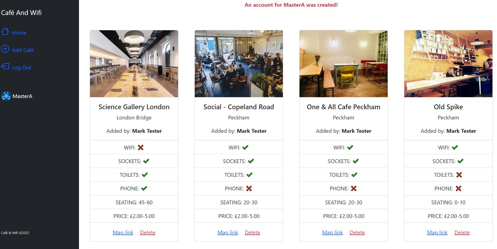 

---

***Log in view.*** 
 

---

***Home page - mobile view. *** 
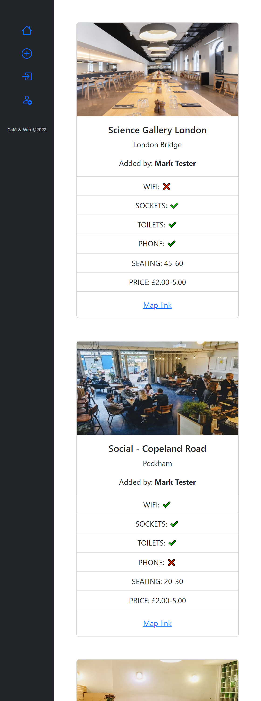 

---

***Account creation - mobile view. *** 
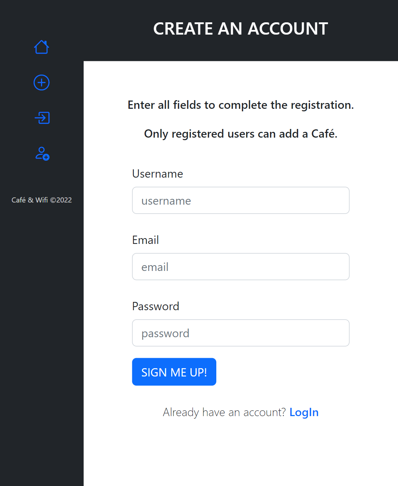 

---

***Sign in – mobile view.***
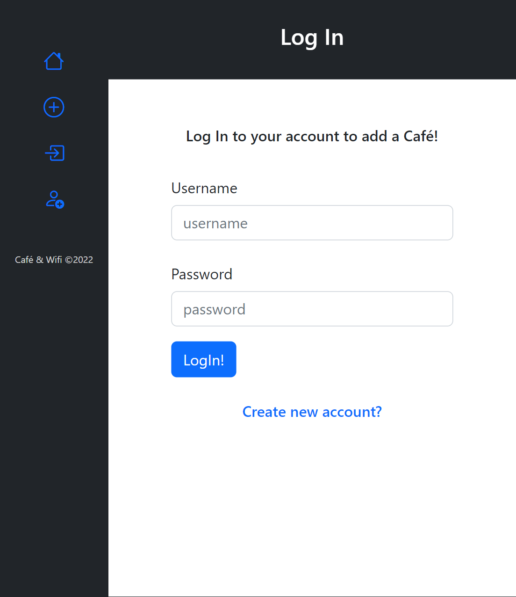 

 

---

**The program was developed using python 3.11.0, Flask 2.2, Flask-Login, Flask - Message Flashing, Flask-SQLAlchemy 3.0, Flask-WTF, SQLite, Hashing passwords with Wergzeug, Flask-Gravatar**

In order to run the program, you have to execute run_main.py.
And your website will be accessible under localhost:5000 (http://127:0:0:1:5000).
