# 08_ToDo_List_Website

This is a fully functional to-do list website. where the user needs to create an account and login in order to use it.
After that, each account will be allowed to create to-do lists where various tasks can be added and, upon completion, marked as done and crossed out. This website makes it possible to keep track of your to-do tasks. To-do lists offer a way to increase productivity by stopping you from forgetting things, helping you prioritize tasks, managing tasks effectively, using your time wisely, and improving time management as well as workflow. This website was built with Python, Flask, SQLite database (a one-to-many relationship), HTML, CSS, JavaScript, and Bootstrap 5.2. 
The main features are: 
- RESTful website: Authenticated users will be able to add / update / delete - ToDo lists and tasks from the database (via Flask HTTP requests and forms WTF and AJAX JavaScript) on the ToDo List website. Only authenticated users will have those rights. 
- a AJAX PATCH request (with JavaScript). 
- User authentication for the website and assigning different permissions based on their status. There will be 2 groups that are distinguished: logged-in users and anonymous users (not logged in).  
- passwords that have been hashed and salted are saved in the database. 
- all data will be stored in a SQLite database and managed using Flask-SQLAlchemy. If env variable 'DATABASE_URL' is defined then the data can be stored in a PostgreSQL database. 
- making use of relational databases (one-to-many relationships) and cascade deletion.  
- message flashing using Flask Flash to give feedback to the user. They will be visible only for one session.  
- a multi-page website with an interactive nav bar.  
- fully mobile responsive with an adaptive nav bar.  
- customised error handling-401-Unauthorized. 
- customised error handling-403-page Forbidden. 
- customised error handling-404-page not found. 
- customised error handling-405 Method Not Allowed. 

The data is stored in three different tables using an SQLite database (if launched locally) managed with the help of Flask-SQLAlchemy. Between these three tables, there exists a database relationship "A one to many," which makes it easy to locate all the to-do lists
created by a certain user, or all the tasks belonging to a list. The ToDoList website can perform POST, GET, DELETE and PATCH HTTP requests in order to create, retrieve, update status, or delete lists, tasks, or users from the database. Furthermore, a cascade deletion between the one-to-many relationship was implemented, which means that deleting a todo lists deletes all related tasks. The same goes for the user. If a user gets deleted, all the related lists get deleted, too.

The main page consists of a welcome page explaining the purpose and functionality of the ToDoList website. In order to use the website, each user has to be authenticated. Only logged-in users can create lists, add tasks to them, and manage them.
The user will be urged to create an account if it hasn't been done yet; otherwise, just logging in will be enough to start using the website.
After logging in, the user will see the first screen where it will be possible to create lists — a ToDo list.
Each list will be listed with the given name and the date of creation. Next, the user will be able to create tasks for each list.
Each task can be customized by adding a tag color, a start date, a due date, and a checkbox indicating task completion. It is an easy way to manage tasks. If the user finishes the selected task, it can be marked as checked, and it will get crossed out. A notification will always appear at the top of the screen, enhancing the user experience (the flash message is visible for one session only). Flask flash messaging was implemented to give feedback to the user if the email address is incorrect, like if it already exists in the database, or if it does not exist and the user tries to login, or if the password was wrong, or when a task will be added, or a list, and many more. 

 
Each user who wants to be authenticated needs to register. After registering, the users' data will be stored securely in the database. Afterwards, the user can simply log in to the ToDo list website.
When the user gets registered, the email address, user name, and hashed password with salt are stored in the database in the users table. This website shows how authentication is done with the use of Flask and Flask-login while maintaining the highest level of security by hashing the user passwords, adding salt to them, and then storing the hash in the database instead of the password itself. Every user who is logged in can always log out.

If the user is not logged in or does not have permission to access a specific website or send a PATCH requests, the server will respond with a customized error message:  
- HTTP 401: Unauthorized 
- HTTP 403: Forbidden  
- HTTP 404: Page not found  
- HTTP 405: Method Not Allowed  

---

Database Schema: 

 

---

Useful Links:

Flask 
https://flask.palletsprojects.com/en/2.2.x/ 

Flask - Message Flashing 
https://flask.palletsprojects.com/en/2.2.x/patterns/flashing/ 

Flask custom filters 
https://flask.palletsprojects.com/en/2.2.x/templating/ 

Flask custom decorators 
https://flask.palletsprojects.com/en/2.2.x/patterns/viewdecorators/?highlight=decorator 

Flask-Login / Authentication 
https://flask-login.readthedocs.io/en/latest/ 

WTForms 
https://wtforms.readthedocs.io/en/2.3.x/ 

Flask-WTF 
https://flask-wtf.readthedocs.io/en/1.0.x/ 

Viewing database - SQLite browser  
https://sqlitebrowser.org/dl/  

Flask-SQLAlchemy 
https://flask-sqlalchemy.palletsprojects.com/en/3.0.x/ 

SQLAlchemy 
https://docs.sqlalchemy.org/en/14/orm/query.html  

Environmental variables 
https://pypi.org/project/python-dotenv/ 

Bootstrap - icons with CDN 
https://icons.getbootstrap.com/ 

Bootstrap 
https://getbootstrap.com/docs/5.2/getting-started/introduction/ 

Jinja templates 
https://jinja.palletsprojects.com/en/3.1.x/ 

Hashing + Salting a password 
https://werkzeug.palletsprojects.com/en/2.2.x/utils/ 
https://werkzeug.palletsprojects.com/en/2.2.x/utils/#werkzeug.security.generate_password_hash 

---

The necessary steps to make the program work: 
1. Install the Python version as stated in runtime.txt (python-3.11.0) 
2. Install the required libraries from the requirements.txt using the following command:  
*pip install -r requirements.txt* 
3. Change the name of .env.example to .env. 
4. Define the Flask environmental variables in .env (https://flask.palletsprojects.com/en/2.2.x/config/#SECRET_KEY): 
**FLASK_SECRET_KEY** = "your_secret_key_keep_it_secret" 
5. You have the option of using the existing database (at this point, you will use SQLite) with defined users and lists or creating a new one (username and password: admin1234). If env variable 'DATABASE_URL' is defined then the data can be stored in a PostgreSQL database. 
Alternatively, you can simply delete the database instance/data.db and then run run_main.py.
A new, empty database will be created, and you will have to register the users and lists. 
I recommend using the SQLite browser to explore the data currently saved in the database (there are three tables; users, to_do_list, task). 
6. Execute run_main.py to ensure that the website is operational on your local host. 
7. Now your website should be running. You can register users, add todo lists, tasks and explore the functionality. 

---

**Example views from the website:** 
 

***Home page view. *** 
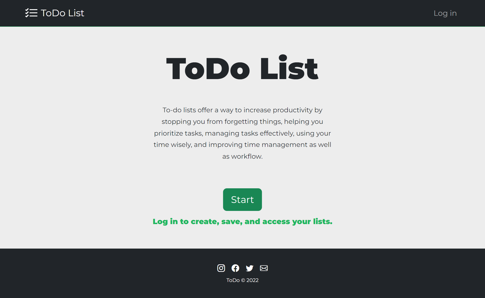 

---

***log in page view. *** 
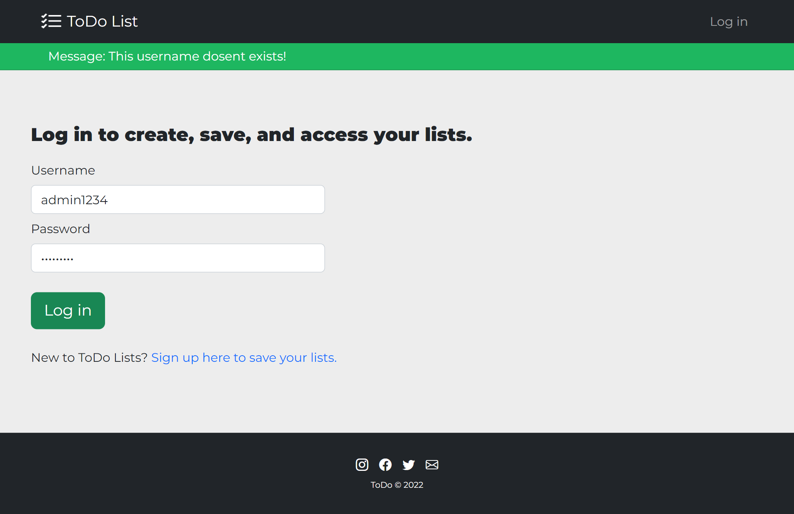 

---

***sign up view. *** 
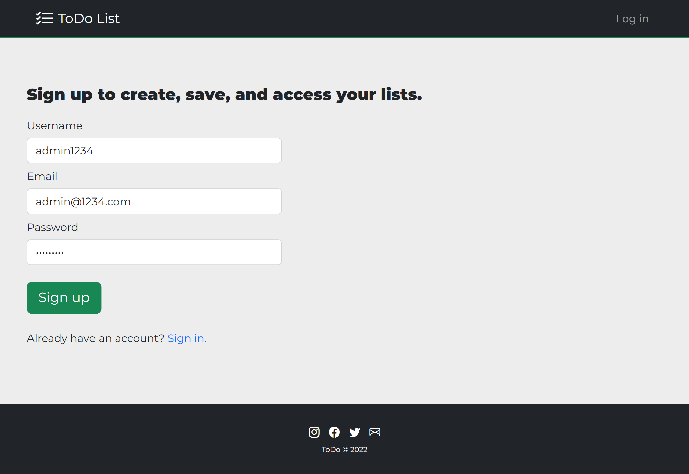 

---

***Main view after login - ToDo lists view. *** 
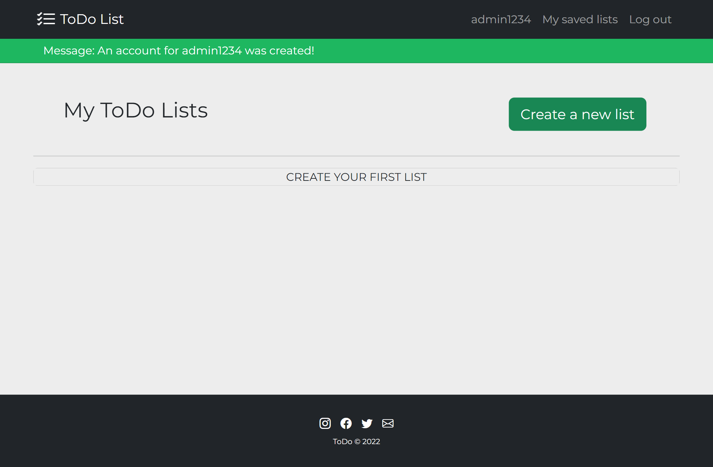 

---

***Creating a ToDo list view.*** 
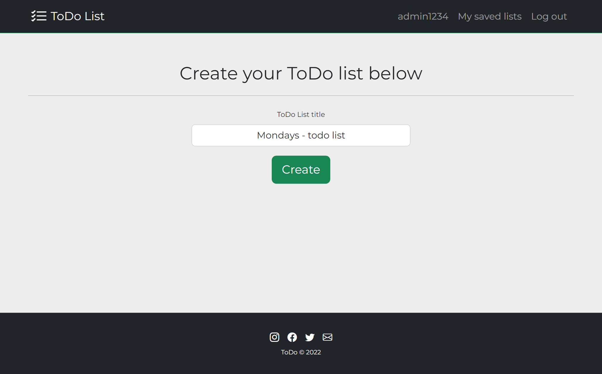 

---

***After creating a todo list view.*** 
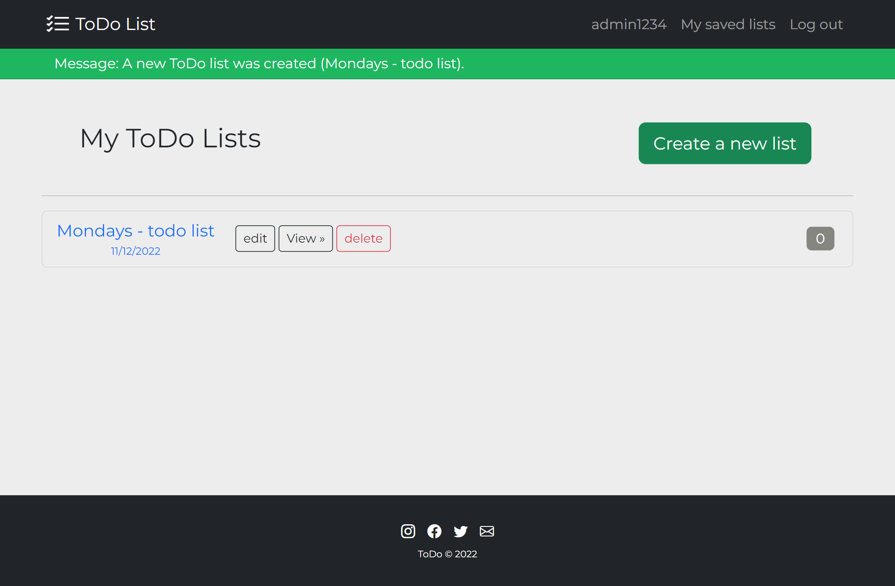 

---

***Edit ToDo List view.*** 
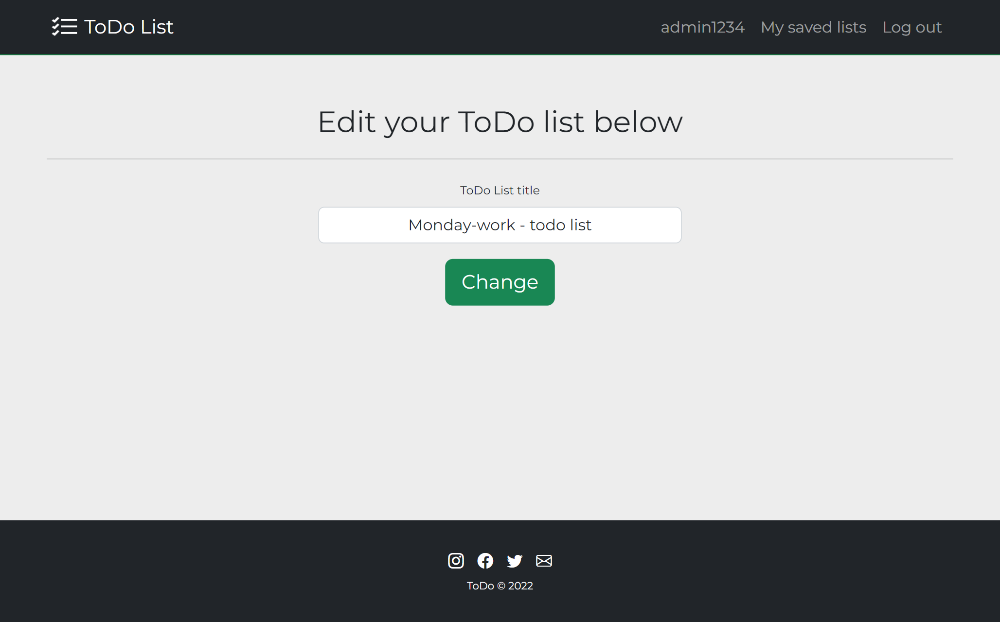 

---

***Detail view of todo list. *** 
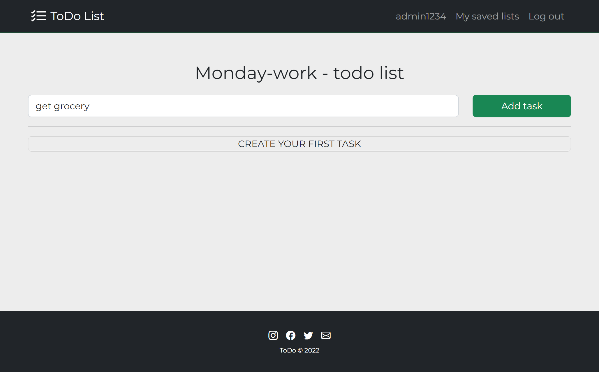 

---

***Detail view of todo list - with 4 added tasks. *** 
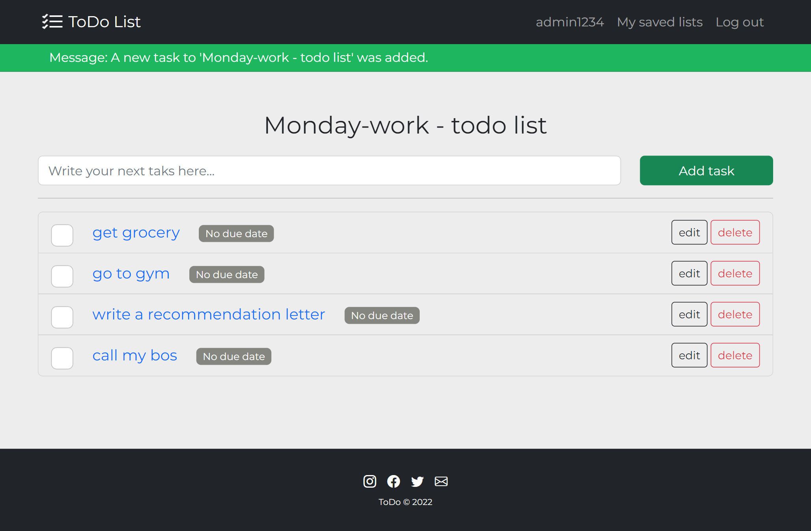 

---

***My saved list view - 4 indicates how many tasks are left to do. *** 
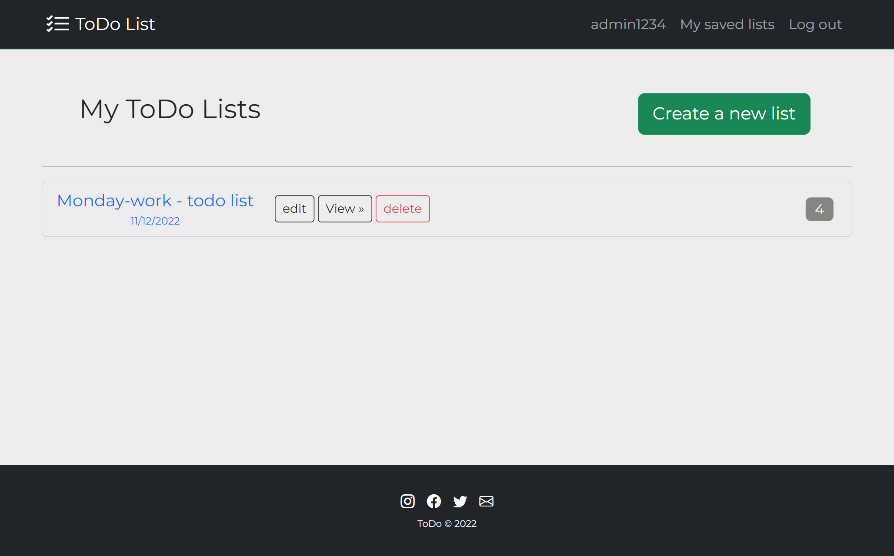 

---

***Edit task view. *** 
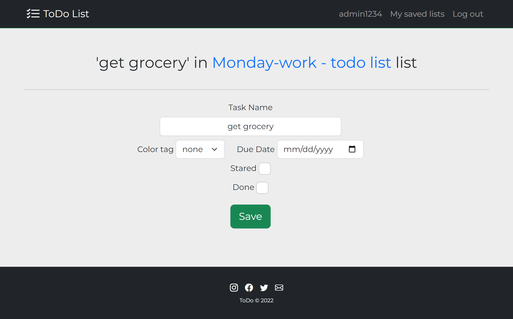 

---

***Detail view - todo list - with tasks edited - customized*** 
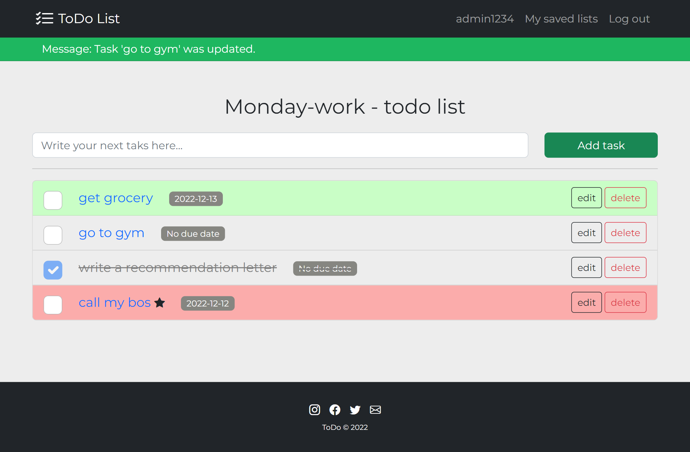 

---

***My saved list view with the remaining (3) tasks to do. *** 
 

---

***Detail todo list view after deleting a task. *** 
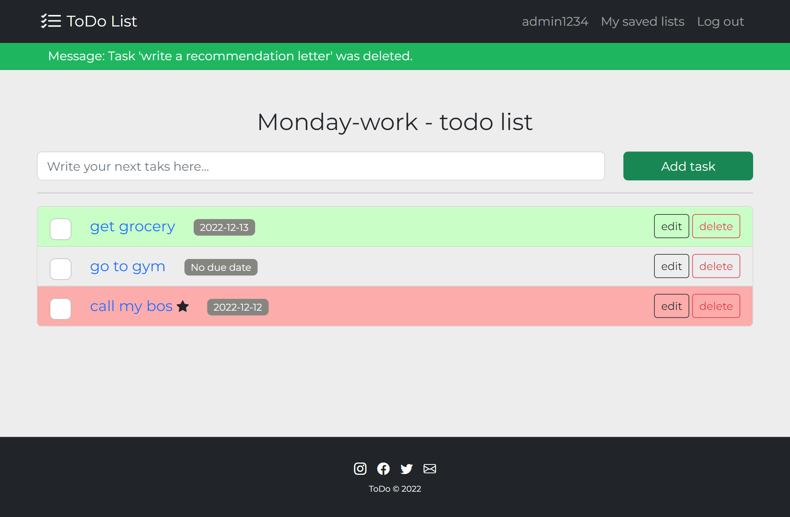 

---

***Custom error - 401 - Unauthorized. *** 
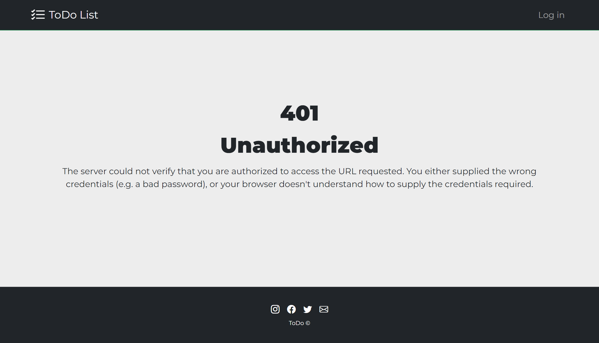 

---

***My saves todo list view - mobile size. *** 
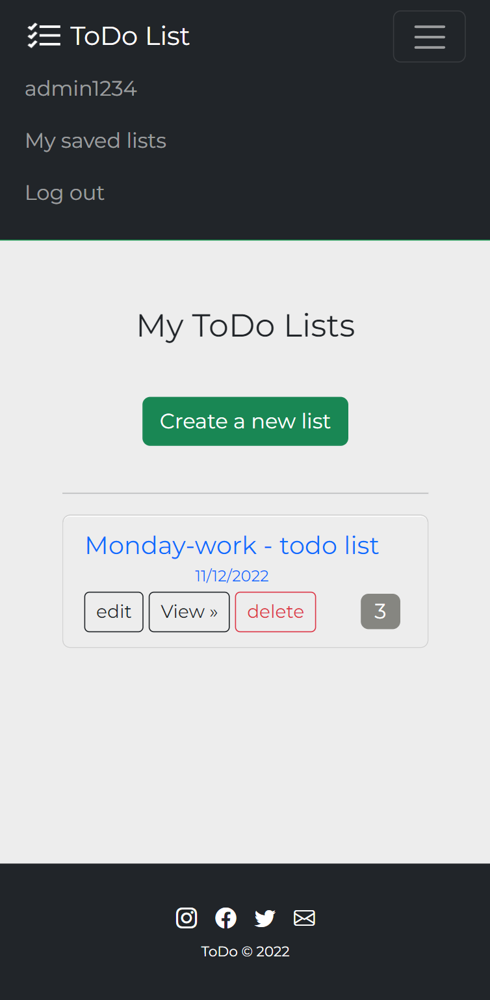 

---

***Detailed todo list view - mobile size*** 
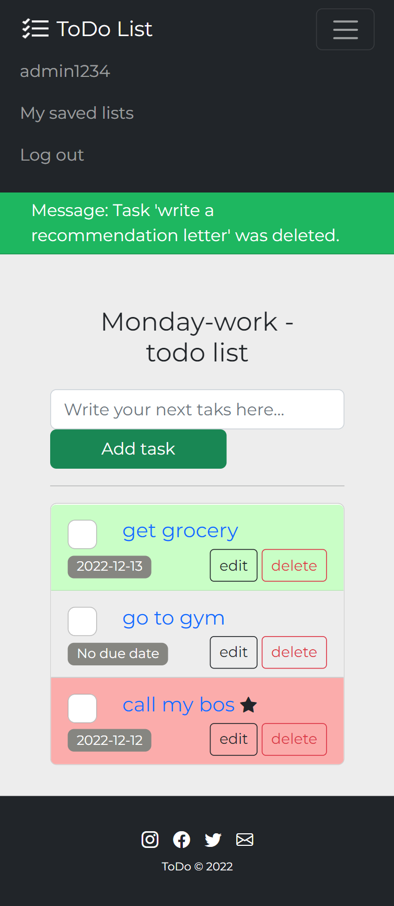 

---

***Edit task view - mobile size. *** 
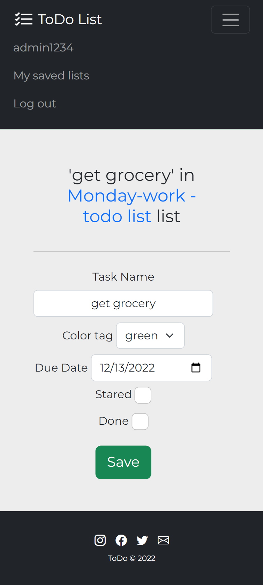 

---

 

---

**The program was developed using python 3.11.0, Flask 2.2, Flask-Login, Flask - Message Flashing, Flask-SQLAlchemy 3.0, Flask-WTF, SQLite, Hashing passwords with Wergzeug, Flask custom filters, Flask custom decorators**

In order to run the program, you have to execute run_main.py.
And your website will be accessible under localhost:5000 (http://127:0:0:1:5000).
