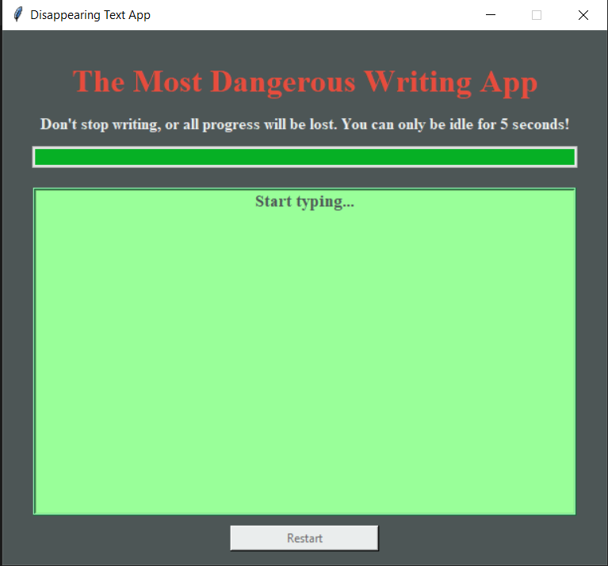
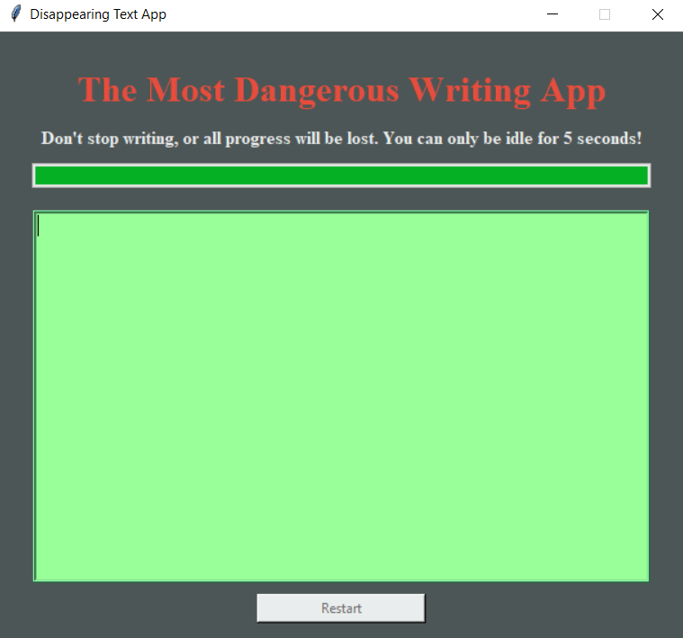
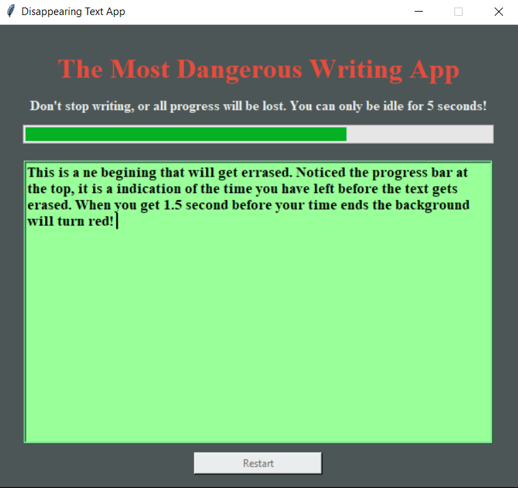
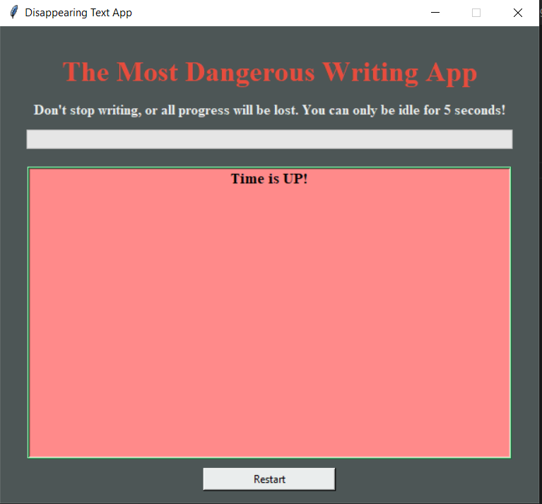

# 09_Disappearing_Text_Writing_App

This desktop application was developed using Python 3.11 and Tkinter to create a graphical user interface. For most writers, a big problem is the writing block. Where you can't think of what to write and you can't write anything. One of the most interesting solutions to this is a web app called The Most Dangerous Writing App, an online text editor where, if you stop writing, all your progress will be lost. A timer will count down, and when the website detects the user has not written anything in the last 5 seconds, it will delete all the text they've written so far. This desktop app has similar functionality to the popular https://www.squibler.io/dangerous-writing-prompt-app. The time remaining will be indicated with a progress bar at the top. Every time the user presses a button, the time will be reset. When there are only 1.5 seconds left, the background will change to red to indicate that it is almost out of time. After the time is up, the text gets erased, and the restart button will be enabled. Pressing it will restart the app to its starting condition. The restart button can only be pressed when the time is up! In the start condition, the input text box will have a placeholder, "Start typing..." If the user clicks in the box, the placeholder will disappear, and if the user presses any keyboard key, the timer will start. Have fun writing your next big novel!

---
 
useful links:  

Tkinter
https://docs.python.org/3/library/tkinter.html

---

The necessary steps to make the program work: 
1. Install the Python version as stated in runtime.txt (python-3.11.0) 
2. Install the required libraries from the requirements.txt using the following command:  
*pip install -r requirements.txt* 
---

**Example view from the Desktop app:** 
 

 

 

 

 

 

 

---

**The program was developed using python 3.11.0 and Tkinter**

In order to run the program, run main.py.
