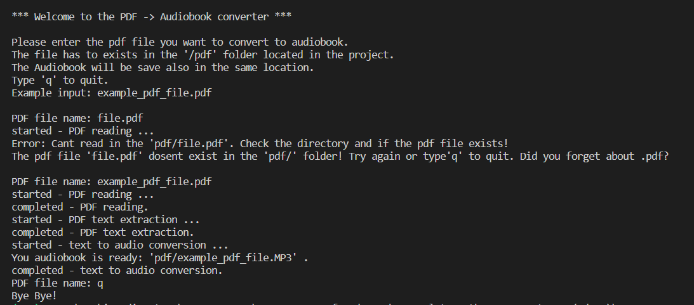

# 10_PDF_to_Audiobook_converter

This is an API-driven Python script that can take a PDF file and convert it into speech.
If you are too tired to read, why not just have the pdf converted into an audio file like an MP3, which you can listen to on your way to
work. This script effectively creates a free audiobook. This program was developed using Python 3.11, object oriented programming concepts, and an API (https://www.voicerss.org/api/) to convert the text file into audio. After running the program, the user must enter the name of the pdf file to be converted to an audiobook or press 'q' to exit. In the next step, the programme will look for that file in the 'pdf/' folder, and if it exists, it will first extract the text from the PDF file and then convert it into an audio file and save it in the same folder. This program has two main classes: one, that is responsible for extracting text from PDFs, and another that is responsible for the text -> audio conversion. This division makes it possible for customization that the user can easily implement. As in text extraction, the user can extract only a specific page rather than the entire file by specifying a parameter. And the API manager class gives the user the option to choose such parameters as language, speed of the voice, and format of the audio file. The OOP methodology gives the option of being easily extended by new parameters.
 
 
---

useful links: 

PyPDF2 
https://pypi.org/project/PyPDF2/  

voicerss - API 
https://www.voicerss.org/api/  

---

The necessary steps to make the program work: 
1. Install the Python version as stated in runtime.txt (python-3.11.0) 
2. Install the required libraries from the requirements.txt using the following command:  
*pip install -r requirements.txt* 
3. You need to create a free account at https://www.voicerss.org/login.aspx and get your API key.
4. Change the name of .env.example to .env. 
5. Define the environmental variables in .env (https://www.voicerss.org/api/): 
**VoiceRSS_API_KEY**="Your_VoiceRSS_API_KEY" - from step 3. 
**VoiceRSS_API_ENDPOINT**="https://api.voicerss.org/" - you can leave this as it is. 

---

**Example view from the Desktop app:** 
 

 

 

---

**The programme was developed using Python 3.11.0, API (https://www.voicerss.org/api/), OPP methodology and PyPDF2**

In order to run the program, run main.py.
