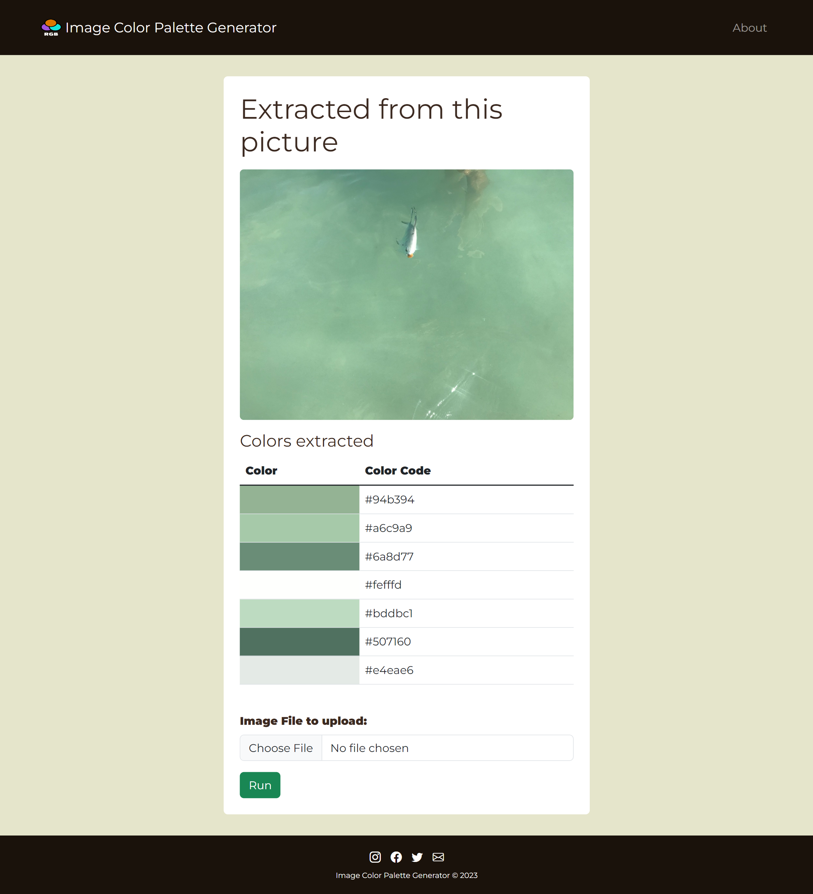
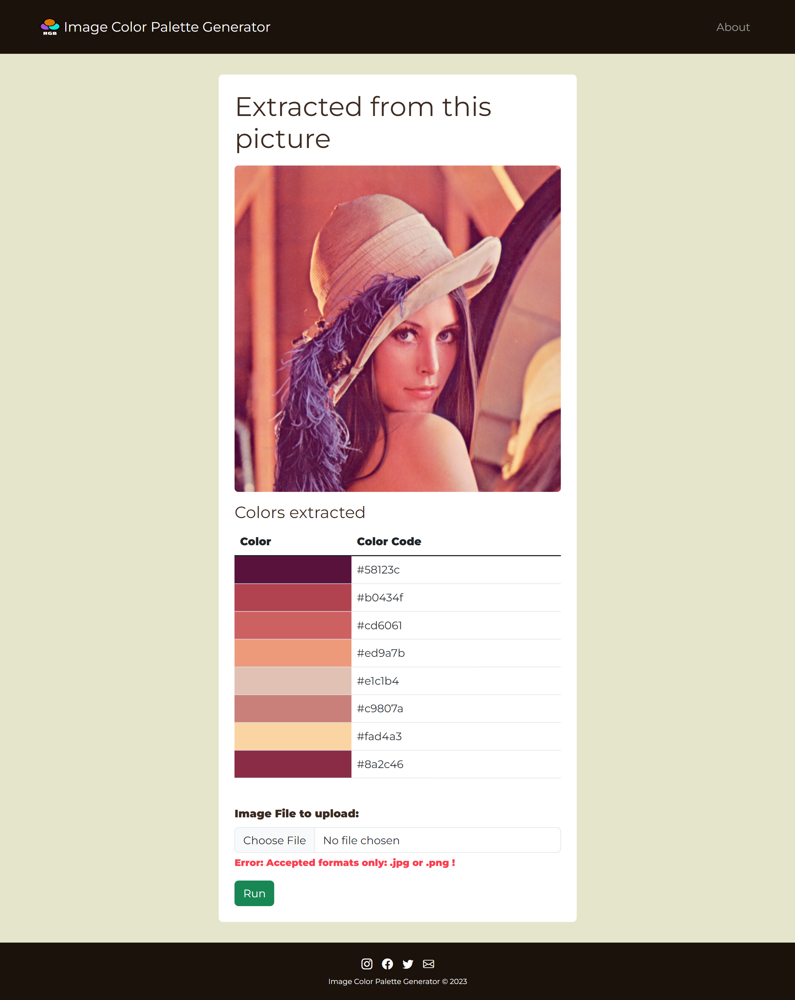
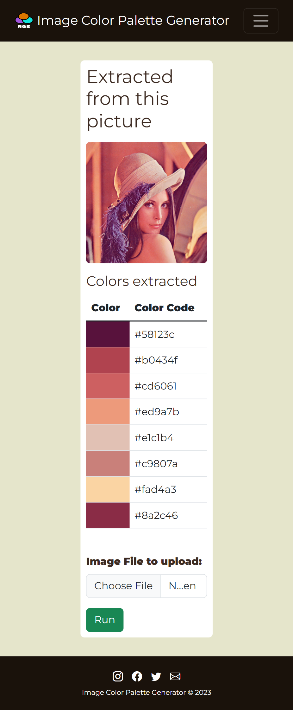
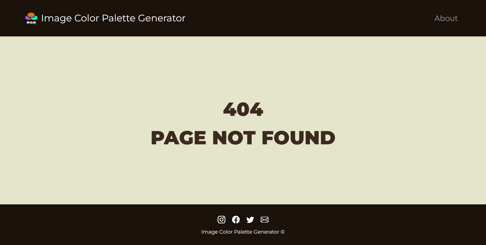

# 11_Image_Color_Palette_Generator

This is a website where the user can upload an image, and it will be processed on the backend side. The most common colors in that image will be extracted from it and listed under the picture with their hex values. This will make it easy to copy the colors if you want to use them in your project. A good example of this functionality can be found on this website: http://www.coolphptools.com/color_extract#demo. Because the website is static, no images are saved on the server; instead, after submitting the form, the file (picture) that the user chose to upload is stored in an in-memory bytes buffer using the buffered I/O implementation. This makes it possible to render images in the HTML without saving them on the server. The form can be submitted with the button RUN. The website was built with the Python web framework - Flask, and the image processing was done with NumPy and Pillow. The styling was done with HTML, CSS, JavaScript, and Bootstrap 5.3. This project is a great example of how to connect a data science task like image processing with a web framework like Flask.
Other features: 
- customized error messages were implemented to improve the user experience. 
- customised error handling-401-Unauthorized.  
- customised error handling-403-page Forbidden. 
- customised error handling-404-page not found. 
- customised error handling-405 Method Not Allowed  
- mobile responsive with an adaptive nav bar 
- using Jinja2 templating 
- image processing using NumPy for identifying the most common colors in the picture 
- the use of pillow librarary for image reading 
- Buffered I/O implementation using an in-memory bytes buffer 
- Directly displaying flask images to HTML without saving them as files on the server 
- FileField validation (format and size) 

---

Useful Links:

Flask 
https://flask.palletsprojects.com/en/2.2.x/ 

WTForms 
https://wtforms.readthedocs.io/en/3.0.x/ 

Flask-WTF 
https://flask-wtf.readthedocs.io/en/1.0.x/ 

Environmental variables 
https://pypi.org/project/python-dotenv/ 

Bootstrap - icons with CDN 
https://icons.getbootstrap.com/ 

Bootstrap 
https://getbootstrap.com/docs/5.3/getting-started/introduction/ 

Jinja templates 
https://jinja.palletsprojects.com/en/3.1.x/ 

NumPy 
https://numpy.org/ 

Pillow 
https://pillow.readthedocs.io/en/stable/ 

io — Core tools for working with streams 
https://docs.python.org/3/library/io.html 

---

The necessary steps to make the program work: 
1. Install the Python version as stated in runtime.txt (python-3.11.0) 
2. Install the required libraries from the requirements.txt using the following command:  
*pip install -r requirements.txt* 
3. Change the name of .env.example to .env. 
4. Define the Flask environmental variables in .env (https://flask.palletsprojects.com/en/2.2.x/config/#SECRET_KEY): 
**FLASK_SECRET_KEY** = "your_secret_key_keep_it_secret" 
5. Execute main.py to ensure that the website is operational on your local host. 
6. Now your website should be running. You can start extracting colors from the uploaded pictures. 

---

**Example views from the website:** 
 

***About page view.*** 
 

---

***Home page view - with the default picture and colors extracted.*** 
 

---

***Home page view - after uploding another image and colors extracted.*** 
 

---

***Home page view - with a validation error after submitting a wrong format image.*** 
 

---

***Home page view - mobile view.*** 
 

---

***Custom Error page view.*** 
 

 

---

**The program was developed using python 3.11.0, Flask 2.2, Flask-WTF, Jinja, NumPy, Pillow, io, HTML, CSS, Bootstrap**

In order to run the program, you have to execute main.py.
And your website will be accessible under localhost:5000 (http://127:0:0:1:5000).
