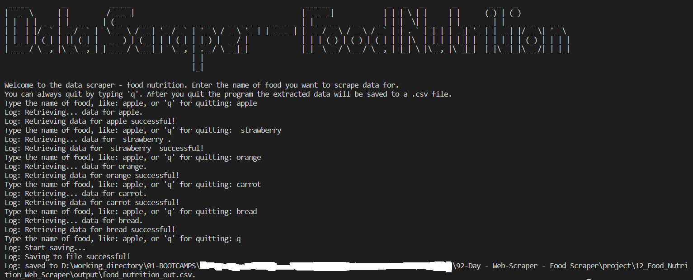
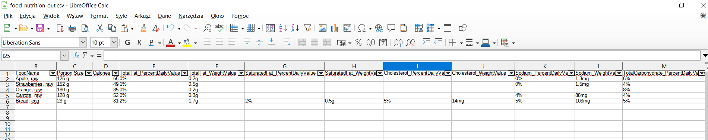
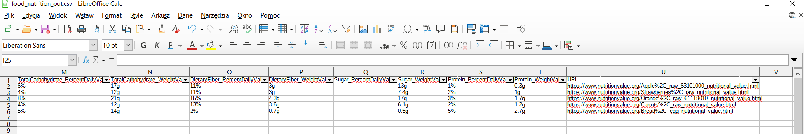

# 12_Food_Nutrition_Web_Scraper
This is a web scraping program, that will scrape the nutrition data of the given food and later save the data into a csv file. The website that will be scanned is https://www.nutritionvalue.org/ , this will be used as our reference. The user will have to type which food he wants the data for, like: carrots, apples, beef, or so on. Each food item will be typed individually, and the user will have the option to quit the program at any time by typing "q". After the program receives this instruction, all the nutrition data scraped that the user requested will be stored in output/food_nutrition_out.csv . The console will also display messages while extracting and saving data to inform the user of what is happening or whether an error occurred during this process. This program uses Python's BeautifulSoup library to scrape data. It was developed according to object-oriented methodology, and it could be easily incorporated into any project or scaled up with more functions.
 
 
---
 

Useful Links:  

BeautifulSoup 
https://pypi.org/project/beautifulsoup4/ 
https://www.crummy.com/software/BeautifulSoup/bs4/doc/  

requests  
https://pypi.org/project/requests/ 

Pandas -> save as csv file 
https://pandas.pydata.org/docs/reference/api/pandas.DataFrame.to_csv.html 

re — Regular expression operations 
https://docs.python.org/3/library/re.html 
 

---

Necessary steps to make the program work: 

1. Install the Python version as stated in runtime.txt (python-3.11.0) 
2. Install the required libraries from the requirements.txt using the following command:  
*pip install -r requirements.txt* 
3. Execute main.py to run the program. 
4. Start typing the food names you are interested in. 

---

***Example view of the program:*** 

---

**The program was developed using python 3.11.0, BeautifulSoup, requests, dotenv, pandas, regular expressions, lxml’s HTML parser**

In order to run the program, you have to execute main.py.

