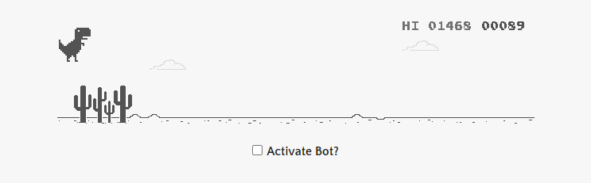
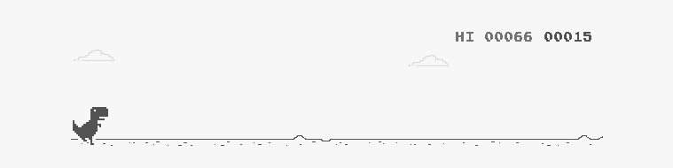
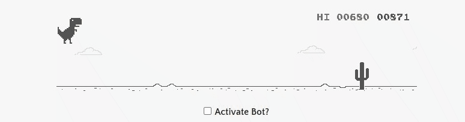
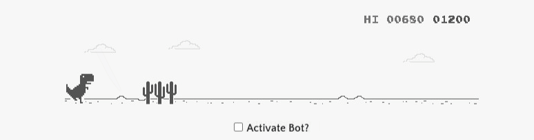

# 13_Bot_Playing_the_Google_Dinosaur_Game
This is a bot that will play the famous Google Dinosaur game that you can find here: https://elgoog.im/t-rex/.
After starting the program, the boat will launch the above mentioned website, and it will start playing the game, by instructing the dinosaur to jump whenever it detects an obstacle on the screen. This program will look at the pixels on the screen to determine if it can find a match with one of the obstacle pictures located in the template folder. If it can, it will return the coordinates, and this is how the bot will now know when to hit the up arrow key, which will result in the dinosaur jumping over the obstacle. The program was developed with Selenium to get access to the website as well as to interact with it, like sending commands or using JavaScript code to retrieve the current speed of the dinosaur.
For finding the dinosaur on the website, the pyautogui library was used since this process has to be done only once, because technically the dinosaur is not moving on the screen, but to increase the speed of detecting the obstacles, OpenCv was implemented. It was developed according to object-oriented methodology.

---

Useful Links: 

pyautogui 
https://pyautogui.readthedocs.io/en/latest/screenshot.html 

OpenCV 
how to find elements 
https://docs.opencv.org/4.x/d4/dc6/tutorial_py_template_matching.html 
how points are measured with OpenCV 
https://chayanvinayak.blogspot.com/2013/03/bounding-box-in-pilpython-image-library.html 
OpenCv is faster at finding elements than pyautogui 
https://www.thekerneltrip.com/python/utils/python-fast-screenshot-locate-on-screen/ 

Selenium 
https://selenium-python.readthedocs.io/ 

Numpy 
https://numpy.org/doc/ 

Pillow 
https://pillow.readthedocs.io/en/stable/ 

---

The necessary steps to make the program work: 
1. Install the Chrome web browser https://www.google.com/intl/en_uk/chrome/  
2. Download Chrome Driver (don't forget to match the version of your Chrome with the version of the Chrome Driver) https://chromedriver.chromium.org/downloads, and unzip the file for your OS. This files has to be located in the main folder of your project in a folder called "ChromeDriver_browser" and the file has to be called "chromedriver.exe" (./13_Bot_Playing_the_Google_Dinosaur_Game/ChromeDriver_browser/chromedriver.exe), For extra information, refer to chrom_driver_path.py, which creates the absolute path for the webdriver. 
3. The user can adjust the duration of the bot playing the game in the main.py: 
*game_time = TimeOut(mins=5)* - mins that the bot will play the game. 
4. Install the required libraries from the requirements.txt using the following command:  
*pip install -r requirements.txt* 

---

***Example view of the bot playing the google game - Dino:*** 

---

**The program was developed using python 3.11.0, Selenium, pathlib, pyautogui, OpenCV - cv2, Numpy, Pillow, JavaScript**

In order to run the program, you have to execute main.py.