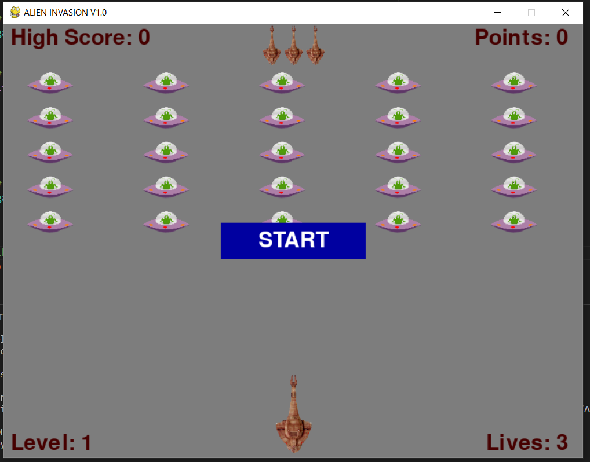
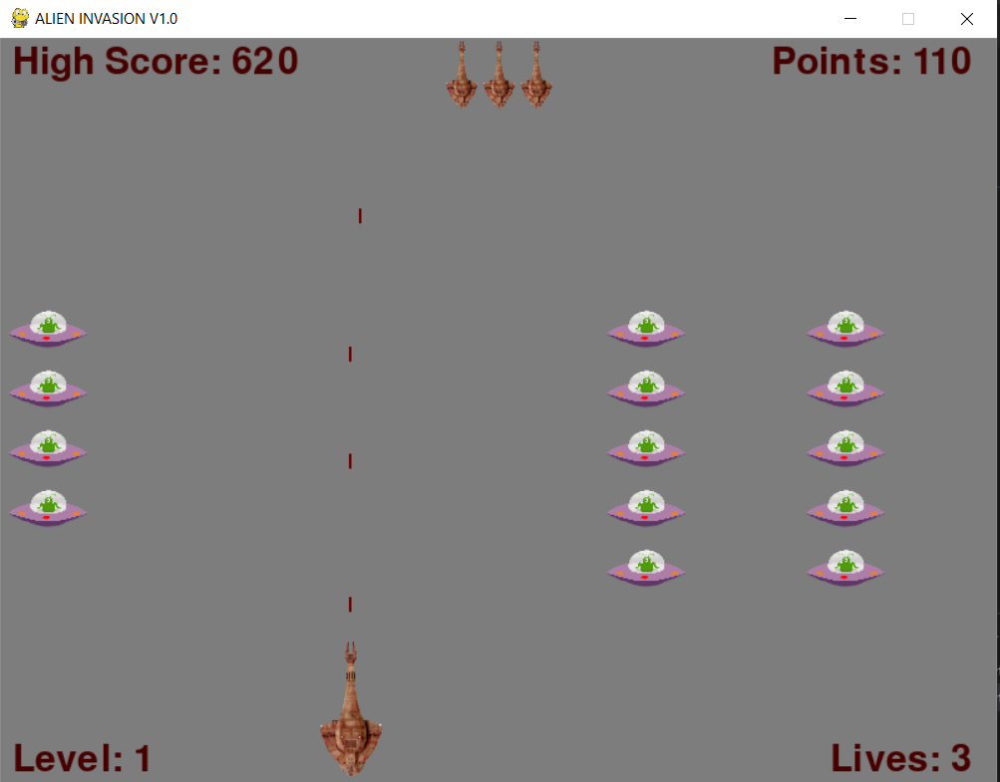

# 14_Space_Invaders
Space Invaders (https://en.wikipedia.org/wiki/Space_Invaders) is a 2D video game in which the player fights aliens that are falling from above. The user controls the space ship by moving it left and right, and it can shoot rockets, which can destroy the alien space ships if they hit them. Every second, the aliens will move closer to your ship. Once the aliens touch your ship, it's game over. If you destroy all alien ships, you will move to the next level, where the alien ships move faster. Each time you reach a new level, you will get more points for destroying the alien ships. For a better user experience, the score, high score, remaining lives, and current level will be constantly visible on the main screen. The highest score will be saved into a json data file called game_stats.json; this way, even after closing and playing again, the high score will be saved. The objects, like the alien space ships or the player space ship, are rendered from pictures located in the folder images. The game was developed using Python 3.11.0 , Pygame package and according to object-oriented methodology. 

--- 

Necessary steps to make the program work: 
1. Install the Python version as stated in runtime.txt (python-3.11.0) 
2. Install the required libraries from the requirements.txt using the following command:  
*pip install -r requirements.txt* 
3. Execute main.py to run the game. Hit the ESC keyboard to exit. 

---

**Game View**

 

 

 

---

**The program was developed using python 3.11.0, Pygame 2.1.3.dev8**

In order to run the program, you have to execute main.py.
