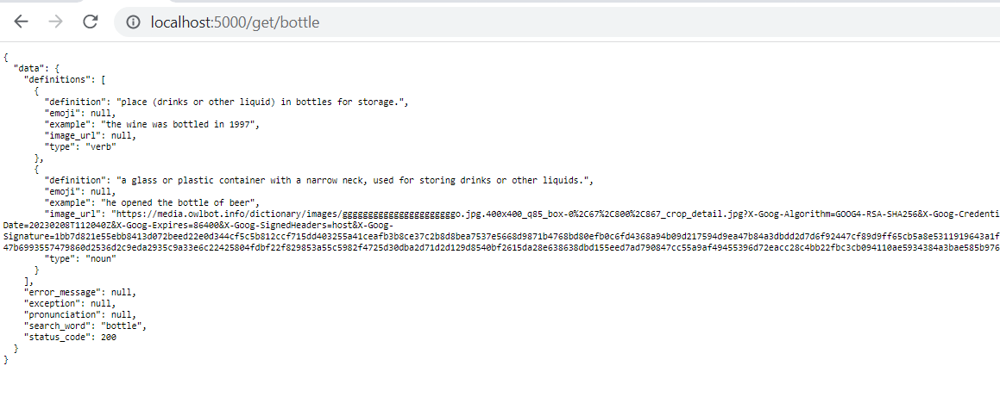
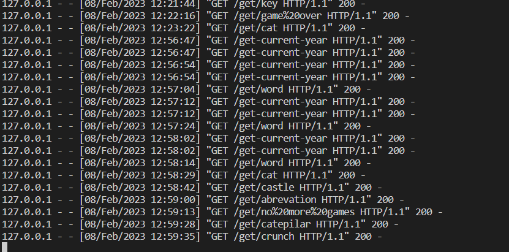
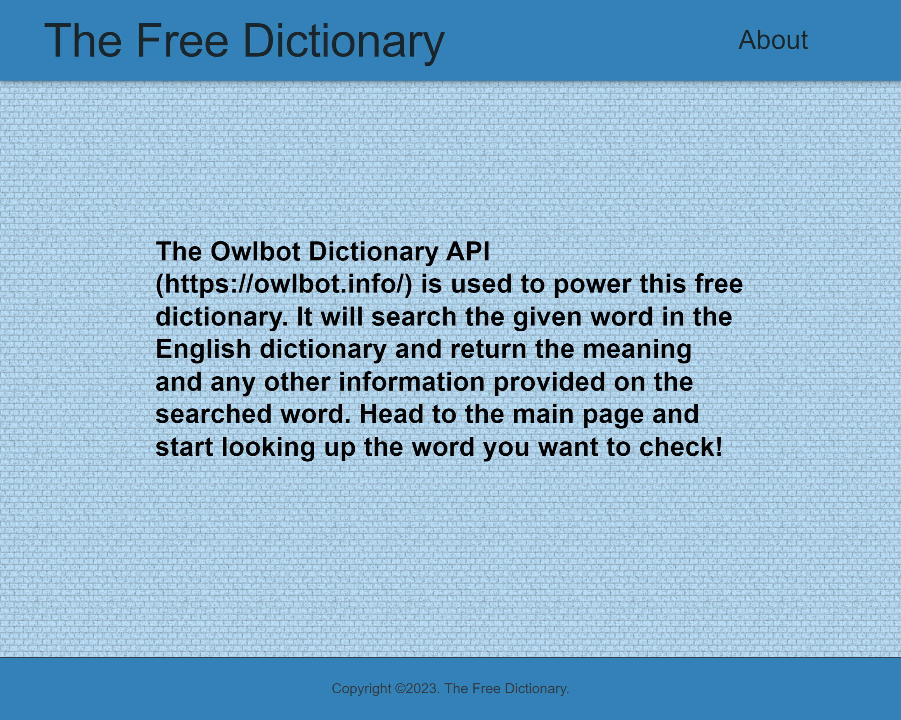
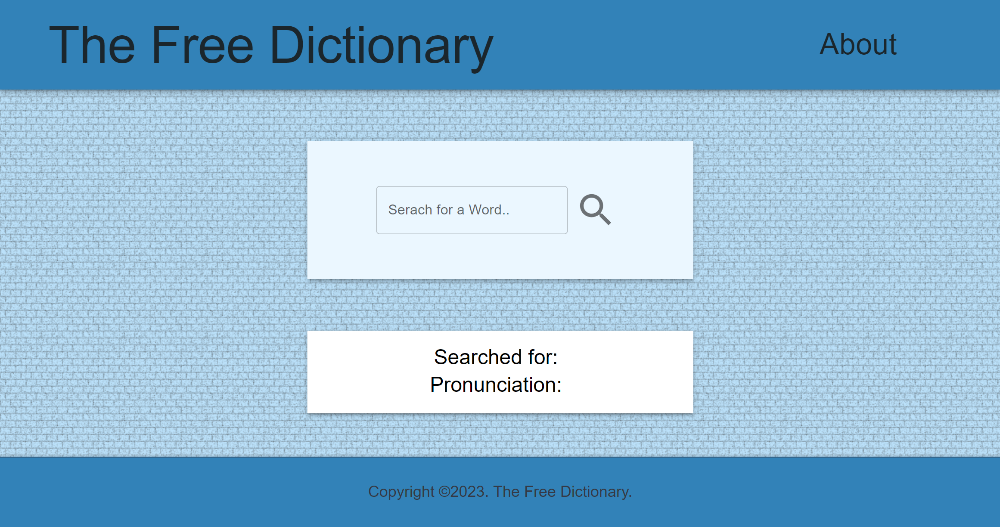
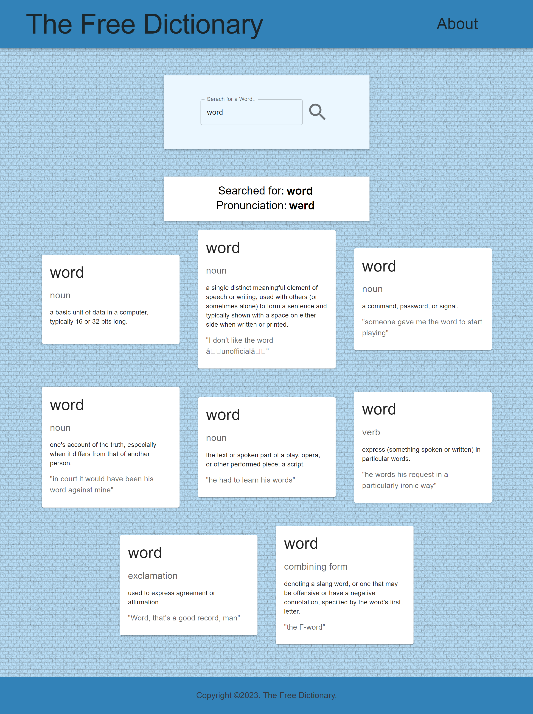
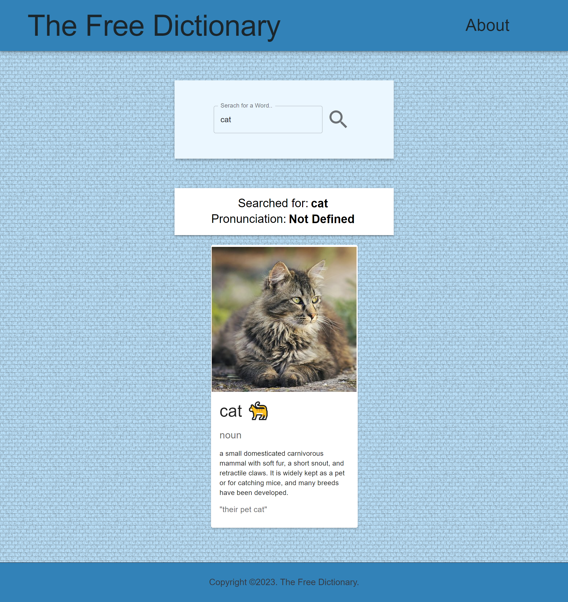
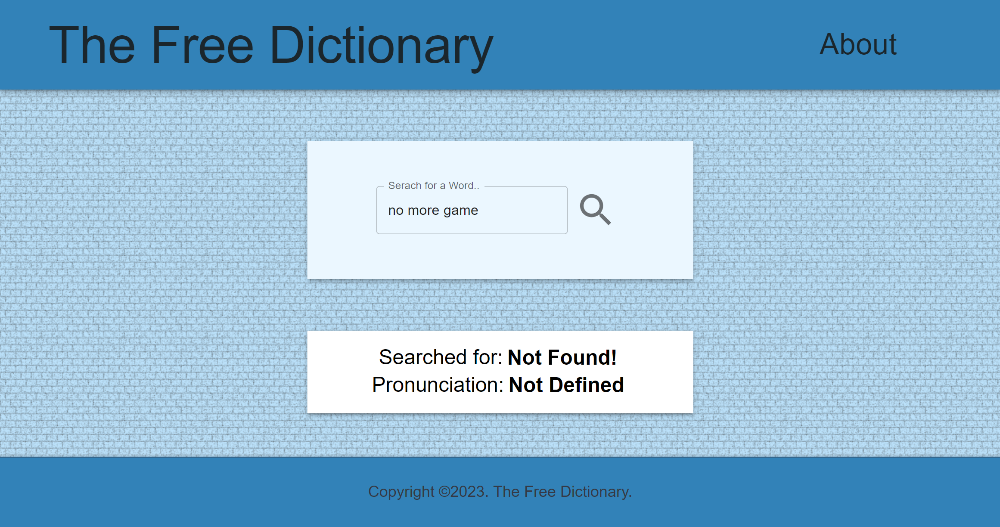
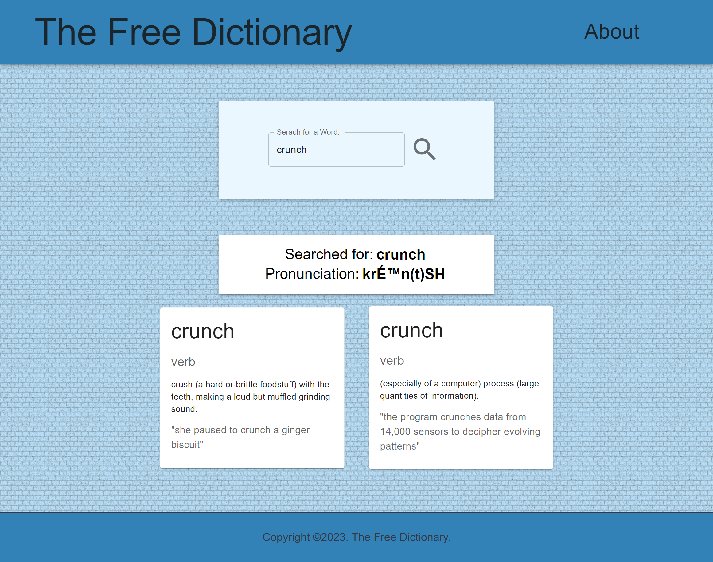

# 15_The_Free_Dictionary_Website
This is a free dictionary website powered by the public Owlbot Dictionary API (https://owlbot.info). The user can type a word, and this word will be searched for in an English dictionary. The results will be retrieved from the API and presented to the user. This website has a backend that was developed with the Python 3.11 library Flask. The backend is responsible for communicating with the third party API and retrieving the data in an easy-to-use way. The front end was developed with React.js to build an interactive user interface. On top of that, the Material-UI and  Material-icons packages were installed and used various predesigned React components. If the word cannot be found, relevant information pointing to a "Not Found" error will be displayed. Otherwise, the user will get a list of card elements, including emoji, pictures, definitions, examples of use, and the type of word to search for. This is a perfect example of a full-stack web application combining Flask (Python) and React.js (JavaScript) to build scalable and easy-to-maintain websites.
  
   
--- 
 
Useful Links: 

 
Owlbot Dictionary API 
https://owlbot.info 

Python 3.11 
https://docs.python.org/3/ 

Flask 
https://flask.palletsprojects.com/en/2.2.x/   

Environmental variables 
https://pypi.org/project/python-dotenv/  

Python - requests 
https://requests.readthedocs.io/en/latest/ 

React.js 
https://reactjs.org/docs/getting-started.html 

Material UI 
https://mui.com/material-ui/getting-started/installation/ 

--- 

# Getting Started with Create React App

This project was bootstrapped with [Create React App](https://github.com/facebook/create-react-app).

## Available Scripts

In the project directory, you can run:

### `npm start`

Runs the app in the development mode.\
Open [http://localhost:3000](http://localhost:3000) to view it in your browser.

The page will reload when you make changes.\
You may also see any lint errors in the console.

--- 

The necessary steps to make the program work: 
For the BackEnd:  
1. Install the Python version as stated in runtime.txt (python-3.11.0) 
2. Navigate in the console to the backend folder and install the required libraries from requirements.txt using the following command:  
*pip install -r requirements.txt* 
3. Change the name of .env.example to .env. 
4. Define the Flask environmental variables in .env (https://flask.palletsprojects.com/en/2.2.x/config/#SECRET_KEY): 
**FLASK_SECRET_KEY** = "your_secret_key_keep_it_secret" 
**OWLBOT_API_Token** = "Your_API_token_from_owlbot" - you can obtain it for free from https://owlbot.info, example: OWLBOT_API_Token='089bdahkfjasggg67t83173y28832td' - the token used in this example is fictional you will need, one that works! 
5. Execute main.py and ensure that the website is operational on your local host. You should see a message like: Running on http://127.0.0.1:5000 – note this address as the location of your website; you will need it to connect to your front end. 
For the FrontEnd:  
6. You must download and install node.js from https://nodejs.org/en/. 
7. Navigate to the frontend folder and run the command "npm install"; this will install all the dependencies. 
8. Next, make sure that the file package. json includes the proxy line: "proxy": "http://127.0.0.1:5000/", where the address should be as in point 5 - where your backend is running. 
9. Next, run the command: npm start. This will start the react.js frontend on your local machine; the address will be something like: http://localhost:3000, and this is where your website will be ready to play with. 

---

**Example views from the website:** 
 

**backend side** 

***example request to the Flask server.*** 
 

***example request from the Flask server.*** 
 

**frontend side**

***About page view.*** 
 

***Search page view.*** 
 

***Search page view.*** 
 

***Search page view.*** 
 

***Search page view.*** 
 

***Search page view.*** 
 

***Search page view.*** 
 

---

**The program was developed using python 3.11.0, Flask 2.2, requests, publlic APIs, Reac.js, Material UI**
